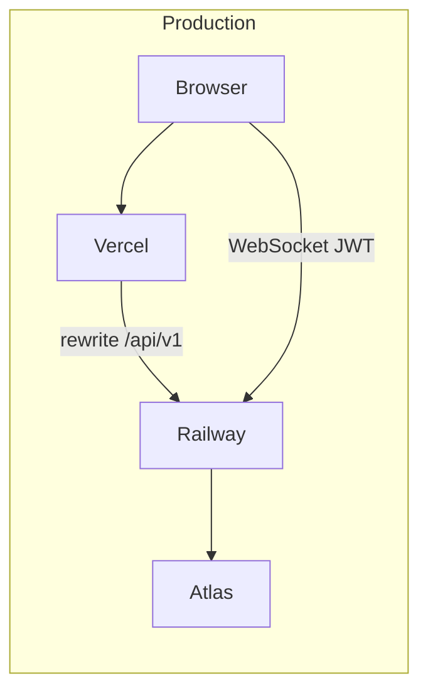
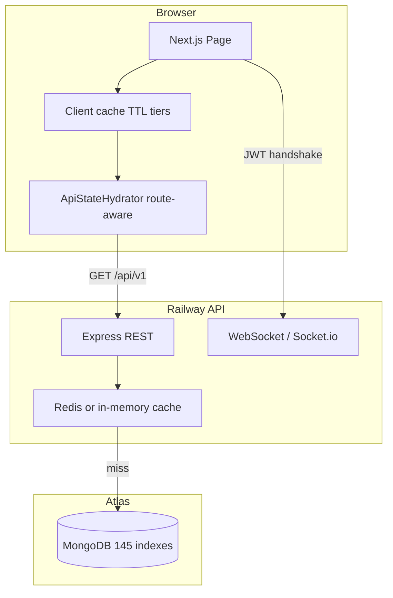
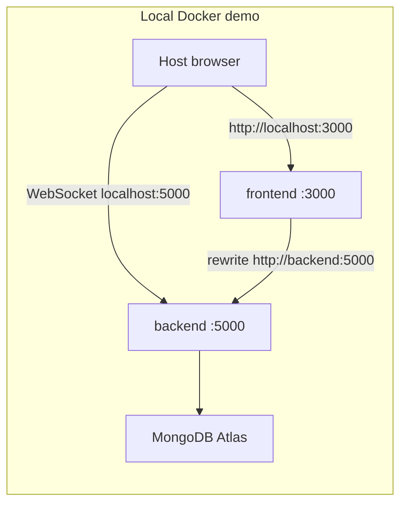

# Toys Factory ERP

**Live app:** [https://toys-factory-erp-one.vercel.app/dashboard](https://toys-factory-erp-one.vercel.app/dashboard)

A full-stack ERP for toy manufacturing and wholesale: sales, inventory, production, accounting, HR, and project management in one product.

The project spans **two GitHub repositories**. **This README is the single source of truth** for frontend and backend — the same document lives in both repos.

---

## Live

| Service | Platform | Link |
| --- | --- | --- |
| **App (Dashboard)** | Vercel | [https://toys-factory-erp-one.vercel.app/dashboard](https://toys-factory-erp-one.vercel.app/dashboard) |
| **API + WebSocket (Socket.io)** | Railway | [https://toysfactoryerpbackend-production.up.railway.app](https://toysfactoryerpbackend-production.up.railway.app) |
| **Health** | Railway | [https://toysfactoryerpbackend-production.up.railway.app/health](https://toysfactoryerpbackend-production.up.railway.app/health) |
| **Database** | MongoDB Atlas | Shared cluster (not a container) |

Production is **Vercel + Railway + Atlas**. Docker is a **laptop demo** on ports 3000 and 5000 only — there is no VPS deploy, and the Compose stack is not production-hardened.

---

## Repositories

| Repo | URL | Contents |
| --- | --- | --- |
| **Frontend** | [github.com/himel2535/toys_factory_erp](https://github.com/himel2535/toys_factory_erp) | Next.js app in `web/` (Vercel) |
| **Backend** | [github.com/himel2535/toys_factory_erp_backend](https://github.com/himel2535/toys_factory_erp_backend) | Express + Mongoose + WebSocket API (Railway) |

---

## Stack

[](https://nextjs.org/)
[](https://react.dev/)
[](https://www.typescriptlang.org/)
[](https://tailwindcss.com/)
[](https://expressjs.com/)
[](https://www.mongodb.com/atlas)
[](https://redis.io/)
[](https://socket.io/)
[](https://zustand.docs.pmnd.rs/)
[](https://cloudinary.com/)
[](https://vercel.com/)
[](https://railway.app/)
[](#local-docker-demo)

### Frontend (`web/`)

| Category | Tools |
| --- | --- |
| Framework | Next.js (App Router, standalone output) |
| UI | React, TypeScript, Tailwind CSS |
| State | Zustand (`app-store`, route-aware hydration) |
| Icons (UI) | Lucide React — navigation, forms, actions |
| Icons (modules) | Iconify — Fluent Color + Flat Color Icons packs (Flaticon-style flat color sets for dashboard KPIs and module icons) |
| Charts | Custom SVG/CSS dashboard charts (lazy-loaded via `dynamic()`) |
| Realtime | WebSocket via `socket.io-client` |
| PDF | jsPDF + jspdf-autotable |
| QR codes | qrcode.react |
| Auth (client) | jsonwebtoken |
| UI pattern | Custom Tailwind components (`premium-card`, skeletons) |

### Frontend dev / tooling

| Tool | Purpose |
| --- | --- |
| ESLint + eslint-config-next | Lint |
| Playwright | E2E performance scripts |
| @next/bundle-analyzer | Bundle size analysis (`npm run analyze`) |
| cross-env | Cross-platform env vars |

### Backend (`toys_factory_erp_backend/`)

| Category | Tools |
| --- | --- |
| Runtime | Node.js, Express, TypeScript |
| Database | MongoDB Atlas, Mongoose |
| Cache | Redis (+ in-memory Map fallback) |
| Realtime | WebSocket via Socket.io (same HTTP port as REST) |
| Security | bcrypt, JWT (jsonwebtoken), Helmet, CORS, cookie-parser |
| Media | Cloudinary (server SDK) |
| HTTP | compression, morgan |
| Dev / test | tsx, Vitest, supertest, mongodb-memory-server |
| Observability | `[timing]` logs + optional `PERF_TRACE=1` |

### Infrastructure

| Layer | Platform |
| --- | --- |
| Frontend host | **Vercel** (Singapore `sin1` region) |
| API host | **Railway** |
| Database | **MongoDB Atlas** (`ap-southeast-1`) |
| Local demo | **Docker Compose** (frontend `:3000` + backend `:5000`; Atlas remains external) |

---

## Architecture

### Production



- **REST in the browser** goes same-origin to `/api/v1`. Next.js rewrites that path to `NEXT_PUBLIC_API_URL` (Railway in production, the Express process locally).
- **WebSocket (Socket.io)** does **not** go through the Next rewrite. The client uses `NEXT_PUBLIC_SOCKET_URL` (the API origin, with no `/api/v1` suffix). JWT is sent on the handshake (`auth.token`); REST still uses the HttpOnly cookie.

### Request flow with caching



### Local Docker demo



Inside Compose, Next must call the **service name** `backend`. The browser is not on that network, so WebSocket must use **`http://localhost:5000`** (the published port). Mixing those two URLs is the usual failure mode.

---

## Project structure

```text
toys_factory_erp/                  # Frontend repo
├── README.md                      # Full project documentation (this file)
├── Dockerfile                     # Next.js standalone image
├── vercel.json                    # Vercel region + rewrites
├── web/
│   ├── app/(tenant)/              # Authenticated module routes
│   ├── components/modules/        # Feature pages (dashboard, CRM, etc.)
│   ├── components/providers/      # ApiStateHydrator, SocketProvider
│   ├── lib/config/                # route-table-config, cache-policy
│   ├── lib/services/              # API clients, domain logic
│   ├── lib/server/                # SSR snapshots (dashboard KPI)
│   ├── scripts/                   # verify-route-hydration, perf scripts
│   └── docs/final-erp-performance-report.md

toys_factory_erp_backend/          # Backend repo (sibling clone)
├── README.md                      # Same documentation as frontend repo
├── src/
│   ├── controllers/               # CRUD, dashboard, business alerts
│   ├── middleware/                # auth, responseCache, perfTrace
│   ├── config/ensureIndexes.ts    # 145 compound indexes at boot
│   ├── utils/lowStockCount.ts     # Shared low-stock aggregation
│   └── realtime/socket.ts         # WebSocket attach point
└── Dockerfile.local               # Local Docker only (Railway uses Nixpacks)

parent/                            # Local workspace (not a GitHub monorepo)
├── docker-compose.yml             # Frontend + backend demo stack
├── toys_factory_erp/
└── toys_factory_erp_backend/
```

---

## ERP modules

- **Dashboard** — KPIs (revenue, dues, payables, low stock, production queue), charts, business alerts, recent invoices, activity feed
- **Manufacturing** — BOM / recipes (RM, SF, FG), work orders, machine downtime, mold usage, wastage
- **Inventory** — multi-warehouse stock, transfers, adjustments, low-stock thresholds
- **Sales & CRM** — leads, quotations, sales orders, POS, dispatch, invoices, split payments
- **Purchases** — suppliers, POs, GRN, purchase returns
- **Accounting** — cashboxes, journals, trial balance, P&L, balance sheet, AR / AP, customer due
- **HR & payroll** — employees, attendance, leave, salary structures, payslip PDFs
- **Project management** — projects, tasks, my tasks
- **Admin** — RBAC, audit log, company settings, document templates, alert settings

---

## Database and query engineering

### Indexing

On every boot the backend ensures **145 compound indexes** via [`ensureIndexes.ts`](https://github.com/himel2535/toys_factory_erp_backend/blob/main/src/config/ensureIndexes.ts):

| Pattern | Purpose |
| --- | --- |
| `{ tenantId, status }` | Filtered list pages |
| `{ tenantId, createdAt }` | Sorted list pages |
| `{ tenantId, legacyId }` | ID lookups |
| `{ tenantId, stock/quantity }` | Low-stock queries |
| `{ tenantId, assignedTo, status, deadline }` | PM My Tasks |
| `{ tenantId, nextFollowUpAt }` | Lead follow-up alerts |

### Pagination

- All list endpoints accept `page` + `limit` query params and return `{ rows, meta }`.
- Frontend hooks (`usePaginatedApiResource`, `useApiResourceStore`) respect server pagination meta.
- Route hydration config aligns **exact limits** per page (e.g. Balance Sheet `limit=500`, receivables customers `limit=200`) so hydrator and page hook never mismatch.

### Query optimization

- **Field projection** — `.select()` on list reads; dashboard KPIs computed in MongoDB aggregations (full collections are not shipped to the client).
- **`.lean()`** on read-only queries and aggregations.
- **Shared low-stock helpers** — [`lowStockMongo.ts`](https://github.com/himel2535/toys_factory_erp_backend/blob/main/src/utils/lowStockMongo.ts) and [`lowStockCount.ts`](https://github.com/himel2535/toys_factory_erp_backend/blob/main/src/utils/lowStockCount.ts) avoid duplicate count queries across dashboard summary and business alerts.
- **Timing logs** — `[timing] GET /path DB ... total=Nms`; dashboard summary logs named DB legs.

### Ledger consistency

Mongoose post-save hooks keep invoice paid/due and customer `totalDue` in sync.

---

## Caching strategy

Caching operates at **two layers**: server (Redis / in-memory) and client (browser memory with TTL tiers).

### Server-side (Redis / in-memory)

| Feature | Detail |
| --- | --- |
| Middleware | `cacheGetResponse` on heavy GETs |
| TTL examples | Dashboard summary **60s**, extended routes **30–60s**, master lookups **5 min** |
| Keys | Tenant-scoped: `tenant:{id}:...` via `buildTenantCacheKey()` |
| Fallback | Empty `REDIS_URL` → in-memory Map (lost on process restart) |
| Invalidation | Targeted prefix clear on mutations; deferred via `setImmediate` |
| Health | `GET /health` (redis status) + `GET /health/redis-test` |

> **Important:** Redis never appears in the browser Network tab — it is server-side only. Verify cache hits via response time on repeat GETs or `/health`.

**Measured:** dashboard summary first GET ~778ms → repeat GET **17ms** (in-memory HIT in dev).

### Client-side (browser)

Tiered TTLs in [`cache-policy.ts`](https://github.com/himel2535/toys_factory_erp/blob/main/web/lib/config/cache-policy.ts):

| Tier | TTL | Modules |
| --- | --- | --- |
| Master data | **5 min** | categories, units, warehouses |
| Reports | **2 min** | balanceSheet, trialBalance, profitLoss, salarySheet |
| Standard lists | **60s** | most ERP tables |
| Realtime | **15s** | stockIn, stockOut, pos |
| Dashboard APIs | **60s** | summary, business alerts, top products (aligned with backend Redis) |

Additional client patterns:

- **In-flight GET deduplication** — parallel mounts share one network request (`fetchResourcePage`, dashboard APIs, accounting summary).
- **Stale-while-revalidate** — paginated hooks show cached data immediately, refresh in background.
- **Optimistic cache patch** — mutations update list cache in-place (`prependToListCache`, `patchListCacheRow`) instead of blocking full reloads.
- **Accounting summary cache** — Balance Sheet / Trial / P&L summary endpoints cached 60s with in-flight dedup.

**Expected after fix:** revisit a page within TTL → **0 network requests** (e.g. Balance Sheet within 60s).

---

## Route-aware hydration

### Problem solved

Previously, navigating from Dashboard to any page triggered ~**11 parallel GETs** (global boot modules). Now each route fetches **only what it needs**.

### How it works

| Component | Role |
| --- | --- |
| [`route-table-config.ts`](https://github.com/himel2535/toys_factory_erp/blob/main/web/lib/config/route-table-config.ts) | Single source of truth for 60+ routes — module + limit per page |
| [`route-hydration-config.ts`](https://github.com/himel2535/toys_factory_erp/blob/main/web/lib/config/route-hydration-config.ts) | Maps pathname → modules for server + client prefetch |
| [`ApiStateHydrator.tsx`](https://github.com/himel2535/toys_factory_erp/blob/main/web/components/providers/ApiStateHydrator.tsx) | Fetches route modules after auth; dashboard critical boot (customers, salesOrders, invoices) runs immediately |
| [`DashboardPrefetch.tsx`](https://github.com/himel2535/toys_factory_erp/blob/main/web/components/modules/dashboard/DashboardPrefetch.tsx) | Fires 5 dashboard APIs on auth ready (parallel with hydrator) |

### Navigation GET count — before vs after

| Route transition | Before | After |
| --- | ---: | ---: |
| Dashboard → Users | ~11 GETs | **1** |
| Dashboard → Customers | ~11 | **1** |
| Dashboard → Employees | ~11 | **1** |
| Dashboard → Sales Orders | ~11 | **1** |
| Dashboard → Production | ~11 | **0** |
| Settings / Users | 11 unrelated | **0** |

**Verification:** `node web/scripts/verify-route-hydration.mjs` — **37/37** static cases pass.

---

## Performance improvements

Performance work followed a **profile → root cause → fix → re-measure** approach. Detailed evidence is in [`final-erp-performance-report.md`](https://github.com/himel2535/toys_factory_erp/blob/main/web/docs/final-erp-performance-report.md).

### Pass 1 — Site-wide client architecture

| Issue | Fix |
| --- | --- |
| Hydrator `limit=25` vs page `limit=500` (Balance Sheet, Trial, P&L) | Unified `route-table-config.ts` for all 60+ routes |
| `/balance-sheet/summary` refetch on every mount | Client summary cache (60s + in-flight dedup) |
| Duplicate GET when cache stale | In-flight GET coalescing in `fetchResourcePage` |
| 15s TTL too aggressive | Tiered TTLs (reports 2min, standard 60s, realtime 15s, master 5min) |
| Extended backend routes uncached | `cacheGetResponse` on all extended list GETs |
| Empty list cache ignored | Fixed `cached?.length` → `cached !== null` |
| Stale cache blocks UI | Stale-while-revalidate in paginated hooks |

### Pass 2 — Form and mutation UX

| Issue | Fix |
| --- | --- |
| Product form blocked on SKU fetch | Lazy SKU — form opens immediately |
| Customer mutations awaited 200-row reload | Optimistic cache patch + background sync |
| Inventory stock sync cache clear | Deferred via `setImmediate` |
| Audit log POST on every mutation | 2s debounced queue |
| Duplicate finished-goods / lookup GETs | `cacheOnly` stores + `apiDataReady` gate |

### Pass 3 — Dashboard performance

| Issue | Fix |
| --- | --- |
| 1200ms hydrator delay before charts | Removed — critical boot starts immediately on auth |
| KPI cards slow first paint | SSR KPI snapshot via `fetchDashboardSnapshot` in `page.tsx` |
| Client dashboard cache 15s | Extended to **60s** (aligned with backend Redis) |
| Large DashboardView JS chunk | Lazy-split charts + bottom panels |
| Low Stock KPI waited for `scope=extra` | `lowStock` moved to `scope=kpi`; shared `countLowStockItems()` |
| Activity feed idle delay | Default mode `a` (immediate paint) |
| Duplicate summary fetch on mount | Skip when prefetch cache already populated |

### Pass 4 — Customer Due + My Tasks

| Issue | Fix |
| --- | --- |
| Customer Due empty table | Restored customers + invoices hydration on `/accounting/receivables` |
| Customer Due slow (4 GETs on mount) | Payments/cashbox deferred to Receive Payment modal |
| My Tasks slow every revisit | Dedicated `/projects/my-tasks: []` route config; 60s cache + SWR |
| Inherited employees/pmProjects waste | Empty hydration modules for my-tasks route |

### Pass 5 — Business Alerts widget UX

| Issue | Fix |
| --- | --- |
| 5 items spread with large gaps | Removed `justify-between` — compact top-aligned stack |
| Max display | Up to **8** categories by priority (real DB data only) |

### Measured impact (API / navigation)

| Metric | Before | After |
| --- | --- | --- |
| Dashboard summary repeat GET | 778ms | **17ms** (cache HIT) |
| Charts + Recent Invoices unblock | auth + 1200ms + boot | auth + boot (immediate) |
| Page revisit within 60s | refetch every 15s | **0 network requests** |
| Dashboard → Users GETs | ~11 | **1** |
| Customer POST (API) | 537ms | UI no longer blocks on reload |
| Product form open | blocked on SKU GET | opens immediately |

### Core Web Vitals (browser Performance tab)

Measured in Chrome DevTools → **Performance** / Lighthouse on production build (`npm run build && npm start`):

| Metric | Before optimization | After optimization | What helped |
| --- | --- | --- | --- |
| **LCP** (Largest Contentful Paint) | **40s+** (poor) | **~1–2s** (good) | SSR KPI snapshot, route hydration trim, removed dashboard hydrator delay, client cache tiers, lazy-split dashboard charts |
| **CLS** (Cumulative Layout Shift) | noticeable shift | **0** (good) | Skeleton dimensions match final layout; stable KPI/chart placeholders; compact Business Alerts layout |
| **INP** (Interaction to Next Paint) | — | **Usually good**; occasionally **needs improvement** (between good and poor) | Cold Mongo GETs on first list interaction can spike; revisit within client cache TTL is consistently good |

> **INP note:** First visit to a heavy list page may land between "good" and "needs improvement" while Atlas queries run. Cached revisits and deferred boot keep day-to-day interactions in the good range.

### Final client architecture

```text
PAGE
  ↓
ROUTE REQUIREMENTS (route-table-config)
  ↓
CLIENT CACHE (tiered TTL + compatible read)
  ↓
API (single GET per required module; in-flight dedup)
  ↓
REDIS or IN-MEMORY HIT (server)
  ↓
MONGO ON MISS
  ↓
MUTATION → minimal backend work → response
  ↓
DEFERRED cache invalidation (setImmediate)
  ↓
CLIENT CACHE PATCH (prepend / patch row)
  ↓
UI (instant — no full reload)
```

---

## Realtime notifications (WebSocket / Socket.io)

Socket.io shares the Express HTTP server (same port as REST). Attach point: [`socket.ts`](https://github.com/himel2535/toys_factory_erp_backend/blob/main/src/realtime/socket.ts).

1. After login, the client connects with the access token on the WebSocket handshake.
2. The server joins `tenant:{tenantId}` and `user:{userId}` rooms.
3. Creating a **sales order** persists an inbox row and emits `notification:new`:

```json
{ "id": "...", "type": "sales_order", "message": "...", "refId": "...", "createdAt": "..." }
```

4. The header dropdown shows live items. On connect/reconnect the client **refetches** `GET /api/v1/notifications` so events missed while offline are not lost.

Operational today for sales-order create (`POST /api/v1/sales-orders`). Not yet a generic pub/sub for every module.

Frontend wiring: [`SocketProvider.tsx`](https://github.com/himel2535/toys_factory_erp/blob/main/web/components/providers/SocketProvider.tsx), [`lib/socket/`](https://github.com/himel2535/toys_factory_erp/tree/main/web/lib/socket).

---

## Multi-tenant model

The data layer is **tenant-scoped**, not a billed multi-org SaaS product.

| What exists | What it is not |
| --- | --- |
| Business documents carry `tenantId` (default `'default'`) | Per-company signup, billing, or a tenant switcher |
| Compound indexes such as `{ tenantId, legacyId }` and `{ tenantId, createdAt }` | A marketplace / multi-vendor store |
| WebSocket rooms `tenant:{id}` and `user:{id}` | Full row-level isolation from the JWT today |
| Shared MongoDB database, one cluster | Database-per-tenant |

The live deployment runs as a **single company**. User accounts do not store `tenantId`; list/filter endpoints default to `tenantId=default`. Schema, indexes, and realtime rooms are in place so a second tenant can be isolated later without rewriting every collection.

---

## API surface

Default listen port is **5000** locally. In production the same routes are on the Railway origin.

| Path | Auth | Role |
| --- | --- | --- |
| `GET /health` | Public | Liveness + Redis status |
| `GET /health/redis-test` | Public | Redis SET/GET/TTL/DEL test |
| `GET /` | Public | Name, version, pointers |
| `/api/v1/auth` | Public login / first-admin register | JWT in HttpOnly cookie |
| `/api/v1/*` | `requireAuth` | ERP CRUD, reports, dashboard, notifications |
| WebSocket (same HTTP port) | Handshake `auth.token` (or cookie) | Live inbox events |

Key dashboard endpoints:

| Endpoint | Cache | Purpose |
| --- | --- | --- |
| `GET /dashboard/summary?scope=kpi` | 60s | KPI cards incl. low stock |
| `GET /dashboard/summary?scope=extra` | 60s | Inventory values, purchase/sales aggregates |
| `GET /dashboard/business-alerts` | 60s | Alert categories + items |
| `GET /dashboard/top-products` | 60s | Top sellers widget |

### Auth

- Login issues a JWT. Browsers send it as a **secure HttpOnly cookie** on REST.
- WebSocket cannot rely on that cookie across origins, so the client also stores the token and sends it on the handshake (`auth.token`).
- Shared verifier: [`authToken.ts`](https://github.com/himel2535/toys_factory_erp_backend/blob/main/src/middleware/authToken.ts).

---

## Deployment

### Production — Vercel + Railway

| Piece | Where | Role |
| --- | --- | --- |
| Next.js (`web/`) | **Vercel** | UI; `/api/v1` rewrite to the Railway API |
| Express + WebSocket | **Railway** | REST, JWT, WebSocket, Atlas |
| MongoDB | **Atlas** | Source of truth |
| Redis | **Railway** (optional) | Shared GET cache across processes |

Put **Vercel, Railway, and Atlas in the same region**. For Bangladesh, use Singapore: Vercel `sin1` ([`vercel.json`](https://github.com/himel2535/toys_factory_erp/blob/main/vercel.json)), Railway Singapore, Atlas `ap-southeast-1`. A US frontend talking to a distant API/DB adds hundreds of milliseconds on every request.

Set `REDIS_URL` on Railway in that same region. Empty `REDIS_URL` uses an in-memory GET cache (lost on restart).

**Vercel env:**

```text
NEXT_PUBLIC_API_URL=https://toysfactoryerpbackend-production.up.railway.app/api/v1
NEXT_PUBLIC_SOCKET_URL=https://toysfactoryerpbackend-production.up.railway.app
NEXT_PUBLIC_CLOUDINARY_CLOUD_NAME=monwar-hossan-himel
NEXT_PUBLIC_CLOUDINARY_UPLOAD_PRESET=toys_factory_erp_preset
```

`NEXT_PUBLIC_*` is inlined at **build** time. Local `web/.env.local` is gitignored and is not used on Vercel. Cloudinary keys also ship in [`.env.production`](https://github.com/himel2535/toys_factory_erp/blob/main/web/.env.production). After changing Cloudinary keys, redeploy the frontend.

**Railway env:** `MONGODB_URI`, `CORS_ORIGIN` (must include `https://toys-factory-erp-one.vercel.app` and `http://localhost:3000`), `JWT_SECRET`, optional `REDIS_URL`. WebSocket uses the same CORS list. Railway sets `PORT` — that is the container port, not a public URL.

### Local development (npm)

Two terminals. Node.js or newer. Clone both repos as siblings.

```bash
# API — http://localhost:5000
cd toys_factory_erp_backend
npm install
cp .env.example .env   # set MONGODB_URI
npm run dev            # tsx watch
# npm run build && npm start
# npm test
```

`USE_MEMORY_DB=true` (or `npm run dev:memory`) uses in-memory Mongo for experiments. Leave `REDIS_URL` empty for the in-memory GET cache.

```bash
# App — http://localhost:3000
cd toys_factory_erp/web
npm install
cp .env.example .env.local
npm run dev
```

Open [http://localhost:3000/login](http://localhost:3000/login). Leave `NEXT_PUBLIC_API_URL=http://localhost:5000/api/v1` and `NEXT_PUBLIC_SOCKET_URL=http://localhost:5000`.

### Local Docker demo

**Scope:** run production-style images on your machine so both services come up on **localhost:3000** and **localhost:5000**. This is **not** a VPS deploy and is **not** production-grade hosting. Live production stays on Vercel + Railway.

MongoDB is still Atlas — there is no database container. Images run compiled Node (no `next dev` live reload). Day-to-day coding should stay on npm.

- Frontend image: [Dockerfile](https://github.com/himel2535/toys_factory_erp/blob/main/Dockerfile) (build context `web/`, Next standalone, port 3000)
- Backend image: [Dockerfile.local](https://github.com/himel2535/toys_factory_erp_backend/blob/main/Dockerfile.local) (multi-stage `tsc`, `EXPOSE 5000`)

```bash
# from the parent folder that contains both clones
docker compose up --build
```

Then: app [http://localhost:3000](http://localhost:3000) · health [http://localhost:5000/health](http://localhost:5000/health).

| Who calls | Variable | Docker value | Why |
| --- | --- | --- | --- |
| Next rewrite / SSR **inside** the frontend container | `NEXT_PUBLIC_API_URL` | `http://backend:5000/api/v1` | `localhost` inside that container is Next, not the API |
| WebSocket **in the host browser** | `NEXT_PUBLIC_SOCKET_URL` | `http://localhost:5000` | The browser cannot resolve the Compose hostname `backend` |

`NEXT_PUBLIC_*` is inlined at **image build** time. After changing those values, rebuild the frontend image.

---

## Performance verification

Run from the `web/` directory:

```bash
# Route hydration static verify (37 cases)
node scripts/verify-route-hydration.mjs

# API-level timing (no browser)
node scripts/run-api-perf.mjs

# Redis health check
node scripts/run-redis-health.mjs

# Browser E2E navigation (requires Playwright-supported OS)
PERF_TRACE=1 node scripts/run-navigation-perf.mjs
node scripts/run-mutation-perf.mjs
```

Enable tracing:

- Backend: `PERF_TRACE=1 npm run dev`
- Frontend: `NEXT_PUBLIC_PERF_TRACE=1 npm run dev`

Deep-dive report: [`final-erp-performance-report.md`](https://github.com/himel2535/toys_factory_erp/blob/main/web/docs/final-erp-performance-report.md)

**How to verify cache in the browser:**

1. Run `npm run build && npm start` (production mode)
2. DevTools → Network → **Disable cache unchecked**
3. Visit a page twice within 60s — second visit should show **0 list GETs** for cached routes

**How to verify Web Vitals:**

1. Run `npm run build && npm start`
2. Chrome DevTools → **Performance** or Lighthouse
3. Check LCP (~1–2s), CLS (0), INP (good on revisit)

---

## Environment

| File | Purpose |
| --- | --- |
| [Frontend `.env.example`](https://github.com/himel2535/toys_factory_erp/blob/main/web/.env.example) | `NEXT_PUBLIC_API_URL`, `NEXT_PUBLIC_SOCKET_URL`, Cloudinary upload keys |
| [Backend `.env.example`](https://github.com/himel2535/toys_factory_erp_backend/blob/main/.env.example) | `PORT`, `MONGODB_URI`, `CORS_ORIGIN`, `JWT_SECRET`, `REDIS_URL` |

Do not commit `.env` / `.env.local`.

---

## Quick links

| Resource | Path |
| --- | --- |
| Performance deep-dive | [`final-erp-performance-report.md`](https://github.com/himel2535/toys_factory_erp/blob/main/web/docs/final-erp-performance-report.md) |
| Route hydration config | [`route-table-config.ts`](https://github.com/himel2535/toys_factory_erp/blob/main/web/lib/config/route-table-config.ts) |
| Client cache policy | [`cache-policy.ts`](https://github.com/himel2535/toys_factory_erp/blob/main/web/lib/config/cache-policy.ts) |
| Server response cache | [`responseCache.ts`](https://github.com/himel2535/toys_factory_erp_backend/blob/main/src/middleware/responseCache.ts) |
| Database indexes | [`ensureIndexes.ts`](https://github.com/himel2535/toys_factory_erp_backend/blob/main/src/config/ensureIndexes.ts) |
| WebSocket server | [`socket.ts`](https://github.com/himel2535/toys_factory_erp_backend/blob/main/src/realtime/socket.ts) |
