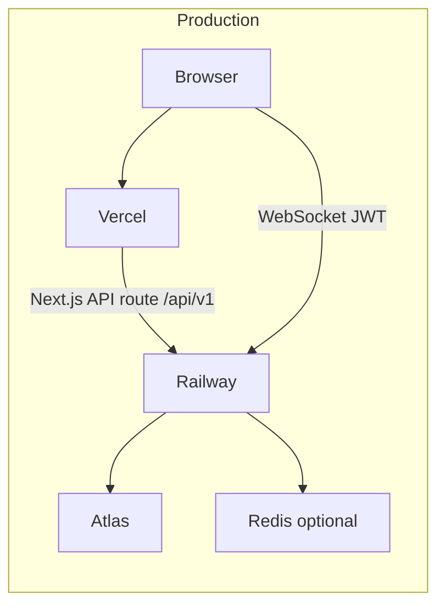
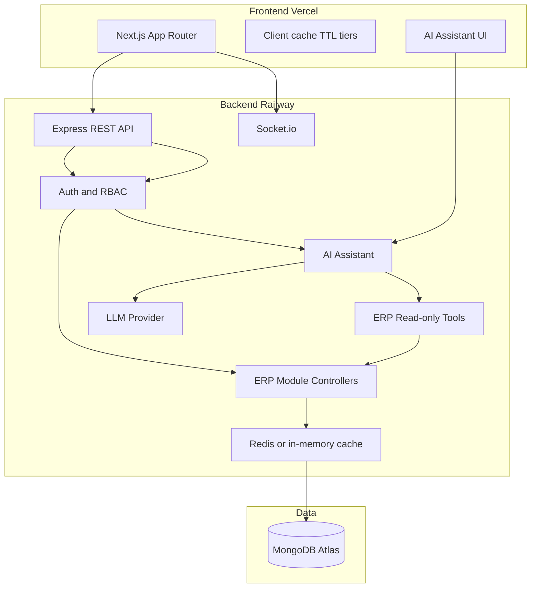
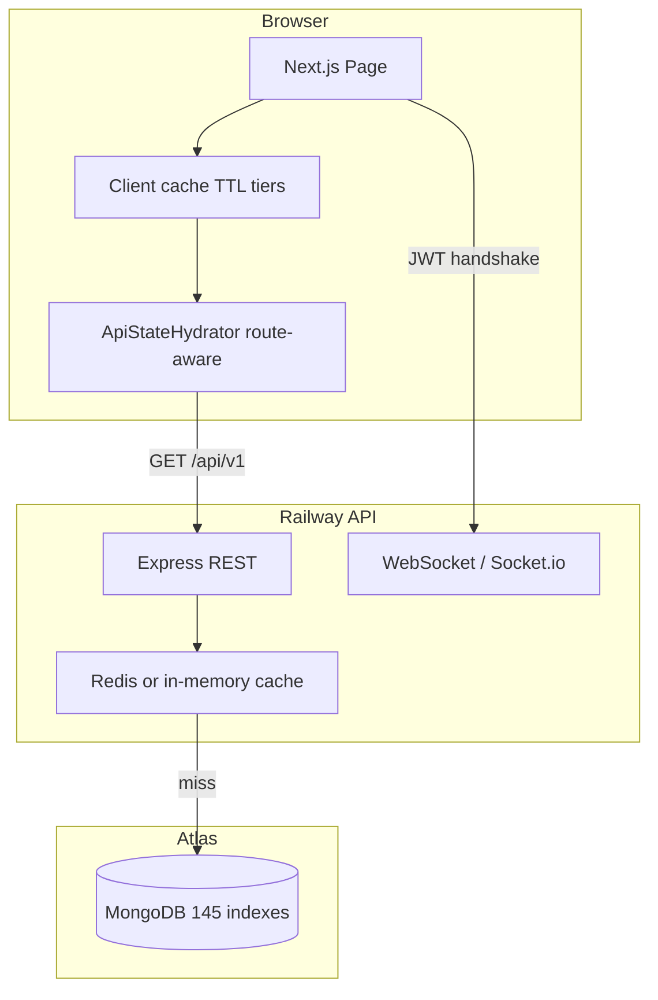
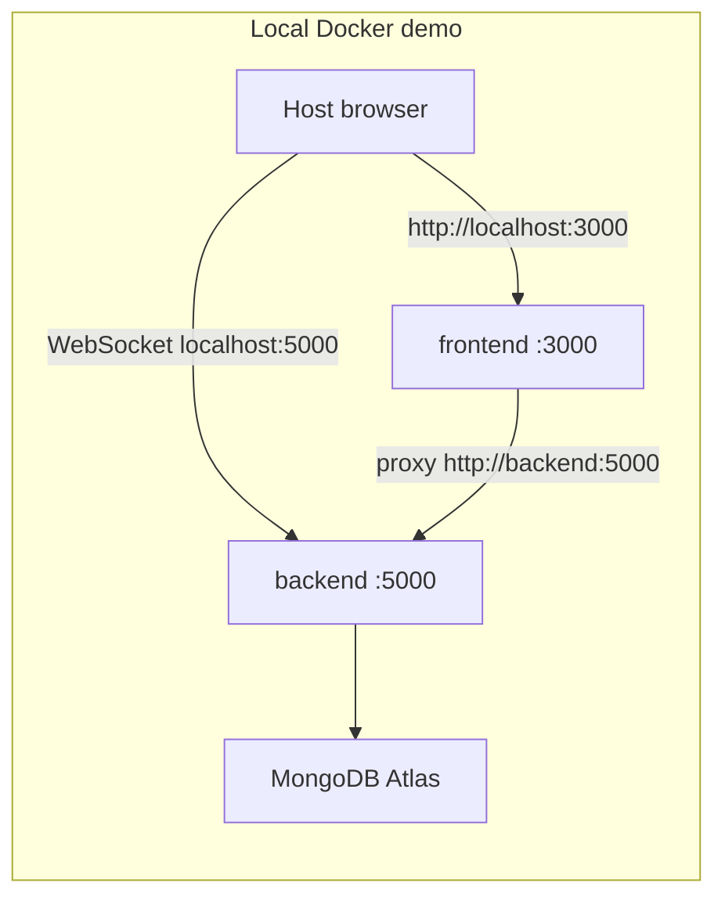

# Toys Factory ERP

**Live app:** [https://toys-factory-erp-one.vercel.app/dashboard](https://toys-factory-erp-one.vercel.app/dashboard)

A full-stack ERP for toy manufacturing and wholesale — sales, inventory, production, accounting, HR, and project management in one product, with an optional LLM-powered business assistant.

The project spans **two GitHub repositories**. **This README is the single source of truth** for frontend and backend — the same document lives in both repos.

---

## Overview

Toys Factory ERP is a production-oriented business application for **manufacturing and wholesale organizations** that need integrated operations in one system: from raw-material inventory and production orders through sales, accounting, and payroll.

| Problem | How the ERP addresses it |
| --- | --- |
| Disconnected spreadsheets and siloed tools | Single tenant-scoped data model with 60+ module routes |
| Slow dashboards and list pages | Multi-layer caching (Redis + client TTL tiers + route-aware hydration) |
| Manual KPI lookups | Dashboard aggregations, business alerts, and optional AI assistant for natural-language queries |
| Wholesale + manufacturing workflows | BOM/recipes, work orders, multi-warehouse stock, POS, invoicing, and accounting reports |

The live deployment runs as a **single company** (tenant-scoped schema, default `tenantId=default`). The stack is **Vercel (frontend) + Railway (API) + MongoDB Atlas**, with optional Redis for server-side GET caching.

---

## Live

| Service | Platform | Link |
| --- | --- | --- |
| **App (Dashboard)** | Vercel | [https://toys-factory-erp-one.vercel.app/dashboard](https://toys-factory-erp-one.vercel.app/dashboard) |
| **API + WebSocket (Socket.io)** | Railway | [https://toysfactoryerpbackend-production.up.railway.app](https://toysfactoryerpbackend-production.up.railway.app) |
| **Health** | Railway | [https://toysfactoryerpbackend-production.up.railway.app/health](https://toysfactoryerpbackend-production.up.railway.app/health) |
| **Database** | MongoDB Atlas | Shared cluster (not a container) |

Production is **Vercel + Railway + Atlas**. Docker is a **laptop demo** on ports 3000 and 5000 only — there is no VPS deploy, and the Compose stack is not production-hardened.

---

## Repositories

| Repo | URL | Contents |
| --- | --- | --- |
| **Frontend** | [github.com/himel2535/toys_factory_erp](https://github.com/himel2535/toys_factory_erp) | Next.js app in `web/` (Vercel) |
| **Backend** | [github.com/himel2535/toys_factory_erp_backend](https://github.com/himel2535/toys_factory_erp_backend) | Express + Mongoose + WebSocket API (Railway) |

---

## Key Features

Modules verified from backend routes (`api.routes.ts`, `extendedRoutes.ts`):

| Domain | Capabilities |
| --- | --- |
| **Dashboard & analytics** | KPIs (revenue, dues, payables, low stock, production queue), charts, business alerts, recent invoices, activity feed, sales/revenue trends |
| **Manufacturing** | BOM / recipes (RM, SF, FG), production orders, machine maintenance, molds, wastage, packing |
| **Inventory** | Multi-warehouse stock, transfers, adjustments, stock-in/out workflows, low-stock alerts, SKU generation |
| **Sales & CRM** | Leads, deals, quotations, sales orders, POS, dispatch, invoices, payments, returns, complaints, CRM activities, wholesale orders |
| **Purchases** | Suppliers, purchase orders, goods received, vendor bills, purchase payments, returns |
| **Accounting** | Cashboxes, journals, ledger, trial balance, P&L, balance sheet, AR/AP, customer due |
| **HR & payroll** | Employees, departments, designations, attendance, leave, salary structures, payroll runs, payslip PDFs |
| **Project management** | Projects, tasks, my tasks, team overview |
| **Reports** | Sales, product sales, purchases, inventory, customers, suppliers, financial, HR |
| **Admin & settings** | RBAC (roles, permissions), users, audit log, company settings, documents, workflow approvals, assets, notifications |
| **AI Assistant** | LLM-powered natural-language queries over read-only business metrics (opt-in, dashboard-gated) |
| **Realtime** | WebSocket notifications for sales-order create (Socket.io) |
| **Performance** | Redis/in-memory server cache, client TTL tiers, route-aware hydration, optimistic cache patches |

---

## AI Assistant / LLM Engineering

The ERP includes an **optional AI business assistant** (Phases 6–17, backend-complete). Users ask natural-language questions; the backend runs an LLM agent loop with read-only ERP tools that reuse existing metrics services.

### Current implementation

| Capability | Status |
| --- | --- |
| LLM-powered ERP assistant (`POST /api/v1/ai/chat`) | Implemented |
| Provider abstraction (OpenAI-compatible + llama.cpp) | Implemented |
| Five read-only ERP tools (sales, revenue, dashboard, low stock) | Implemented |
| Tool validation, RBAC, forbidden-argument blocking | Implemented |
| Prompt injection protection (regex guard) | Implemented |
| Per-user rate limiting (process-local) | Implemented |
| Token/cost controls + tool-result compression | Implemented |
| Process-local observability + admin metrics endpoint | Implemented |
| Offline AI evaluation framework (32 mocked cases) | Implemented |
| Production-oriented error handling | Implemented |

**Not implemented:** streaming, RAG, vector DB, conversation memory, distributed AI metrics/rate limiting.

### API endpoints

| Method | Path | Auth | Purpose |
| --- | --- | --- | --- |
| `POST` | `/api/v1/ai/chat` | Authenticated + dashboard section | Natural-language query → `{ message }` response |
| `GET` | `/api/v1/ai/metrics` | Admin only | Process-local aggregate AI metrics |

Enable with `AI_ENABLED=true` and provider env vars in backend `.env.example`.

### Documentation

| Document | Scope |
| --- | --- |
| [Backend AI / LLM Engineering](https://github.com/himel2535/toys_factory_erp_backend/blob/main/docs/AI-LLM-ENGINEERING.md) | Provider architecture, tools, security, observability, evaluation |
| [Frontend AI Assistant UI](https://github.com/himel2535/toys_factory_erp/blob/main/docs/AI-LLM-ENGINEERING.md) | Chat UI, Next.js proxy route, long-timeout handling |
| [AI Evaluation Framework](https://github.com/himel2535/toys_factory_erp_backend/blob/main/docs/AI_EVALUATION.md) | Offline harness, dataset categories, test commands |

---

## Architecture

### Production



- **REST in the browser** goes same-origin to `/api/v1`. Next.js **route handlers** proxy to `NEXT_PUBLIC_API_URL` (Railway in production, Express locally). The AI chat endpoint uses a dedicated handler with extended timeout (`web/app/api/v1/ai/chat/route.ts`).
- **WebSocket (Socket.io)** does **not** go through the Next.js API proxy. The client uses `NEXT_PUBLIC_SOCKET_URL` (API origin, no `/api/v1` suffix). JWT is sent on the handshake (`auth.token`); REST uses the HttpOnly cookie.

### Backend layers



### Request flow with caching



### Local Docker demo



Inside Compose, Next must call the **service name** `backend`. The browser is not on that network, so WebSocket must use **`http://localhost:5000`**.

---

## Technology Stack

[](https://nextjs.org/)
[](https://react.dev/)
[](https://www.typescriptlang.org/)
[](https://tailwindcss.com/)
[](https://expressjs.com/)
[](https://www.mongodb.com/atlas)
[](https://redis.io/)
[](https://socket.io/)
[](https://zustand.docs.pmnd.rs/)
[](https://cloudinary.com/)
[](https://vercel.com/)
[](https://railway.app/)
[](#local-docker-demo)

| Layer | Technologies |
| --- | --- |
| **Frontend** | Next.js 16 (App Router, standalone), React 19, TypeScript, Tailwind CSS 4, Zustand |
| **Backend** | Node.js 20+, Express 5, TypeScript, Mongoose 8 |
| **Database** | MongoDB Atlas (145 compound indexes at boot) |
| **Authentication** | JWT (HttpOnly cookie + Bearer), bcrypt, Helmet, CORS |
| **Caching** | Redis 4 (+ in-memory Map fallback for GET responses) |
| **AI / LLM** | Native fetch, OpenAI-compatible HTTP, llama.cpp; opt-in via env |
| **Realtime** | Socket.io (same HTTP port as REST) |
| **Media** | Cloudinary (client unsigned upload + server SDK) |
| **Testing** | Vitest, supertest, mongodb-memory-server, Playwright (perf scripts) |
| **Deployment** | Vercel (frontend), Railway Nixpacks (backend), Atlas (database) |
| **Developer tooling** | tsx, ESLint, @next/bundle-analyzer, cross-env |

---

## Project Structure

```text
toys_factory_erp/                  # Frontend repo
├── README.md                      # Full project documentation (this file)
├── Dockerfile                     # Next.js standalone image
├── vercel.json                    # Vercel region (sin1)
├── docs/
│   └── AI-LLM-ENGINEERING.md      # Frontend AI UI documentation
├── web/
│   ├── app/(tenant)/              # Authenticated module routes
│   ├── app/api/v1/                # Next.js API proxy route handlers
│   ├── components/modules/        # Feature pages (dashboard, CRM, etc.)
│   ├── components/ai/             # AI Assistant UI components
│   ├── components/providers/      # ApiStateHydrator, SocketProvider
│   ├── lib/config/                # route-table-config, cache-policy
│   ├── lib/services/              # API clients, domain logic
│   ├── scripts/                   # verify-route-hydration, perf scripts
│   └── docs/                      # Performance reports and benchmarks

toys_factory_erp_backend/          # Backend repo (sibling clone)
├── README.md                      # Same documentation as frontend repo
├── docs/
│   ├── AI-LLM-ENGINEERING.md      # Backend AI / LLM engineering (Phases 6–17)
│   └── AI_EVALUATION.md           # Offline evaluation framework
├── src/
│   ├── ai/                        # LLM provider, tools, chat service, metrics
│   ├── controllers/               # CRUD, dashboard, AI chat, business alerts
│   ├── middleware/                # auth, responseCache, perfTrace
│   ├── routes/                    # api.routes.ts, extendedRoutes.ts
│   ├── services/metrics/          # Shared metrics for dashboard + AI tools
│   ├── config/ensureIndexes.ts    # 145 compound indexes at boot
│   └── realtime/socket.ts         # WebSocket attach point
└── tests/
    ├── unit/ai/                   # AI unit tests (173 tests)
    └── evaluation/ai/             # Offline AI evaluation (32 cases)

parent/                            # Local workspace (not a GitHub monorepo)
├── docker-compose.yml             # Frontend + backend demo stack
├── README-DOCKER.md               # Docker troubleshooting guide
├── toys_factory_erp/
└── toys_factory_erp_backend/
```

---

## API

Default listen port is **5000** locally. In production the same routes are on the Railway origin.

| Path | Auth | Role |
| --- | --- | --- |
| `GET /health` | Public | Liveness + Redis status |
| `GET /health/redis-test` | Public | Redis SET/GET/TTL/DEL test |
| `/api/v1/auth` | Public login / first-admin register | JWT in HttpOnly cookie |
| `/api/v1/admin/*` | Admin | Auth user CRUD |
| `/api/v1/*` | `requireAuth` + tenant | ERP CRUD, reports, dashboard, notifications, AI |
| WebSocket (same HTTP port) | Handshake `auth.token` | Live inbox events |

### Route groups (high level)

| Prefix | Modules |
| --- | --- |
| `/dashboard/*` | Summary, trends, alerts, top products, recent invoices |
| `/customers`, `/products`, `/leads`, `/deals`, … | Sales & CRM |
| `/warehouses`, `/raw-materials`, `/stock-*`, … | Inventory |
| `/suppliers`, `/purchase-orders`, `/goods-received`, … | Purchases |
| `/recipes`, `/production-orders`, `/molds`, … | Manufacturing |
| `/journals`, `/ledger`, `/trial-balance`, … | Accounting |
| `/employees`, `/attendance`, `/payroll-*`, … | HR & payroll |
| `/pm-projects`, `/pm-tasks` | Project management |
| `/reports/*` | Cross-module reports |
| `/ai/chat`, `/ai/metrics` | AI assistant (chat + admin metrics) |

Key dashboard endpoints:

| Endpoint | Cache | Purpose |
| --- | --- | --- |
| `GET /dashboard/summary?scope=kpi` | 60s | KPI cards incl. low stock |
| `GET /dashboard/summary?scope=extra` | 60s | Inventory values, purchase/sales aggregates |
| `GET /dashboard/business-alerts` | 60s | Alert categories + items |
| `GET /dashboard/top-products` | 60s | Top sellers widget |

### Auth

- Login issues a JWT. Browsers send it as a **secure HttpOnly cookie** on REST.
- WebSocket cannot rely on that cookie across origins, so the client also stores the token and sends it on the handshake (`auth.token`).
- Section RBAC enforced via `requireSectionAccess` middleware (`apiSectionMap.ts`).

---

## Security

| Area | Implementation |
| --- | --- |
| **Authentication** | JWT (HttpOnly cookie + Bearer), bcrypt password hashing |
| **Authorization / RBAC** | Role-based section access; admin-only routes and AI metrics |
| **Tenant isolation** | `tenantId` on business documents; resolved from auth middleware |
| **Input validation** | Request validation on AI chat and CRUD endpoints |
| **Protected AI tools** | Read-only allowlist; RBAC per tool; forbidden identity/credential args |
| **Prompt injection protection** | Regex-based guard before LLM call (AI layer) |
| **Rate limiting** | Per-user AI rate limit (process-local, 30 req/min default) |
| **Sanitized logging** | No prompts, responses, API keys, or tool arguments in logs |
| **Secrets** | Environment variables only (`.env.example` templates; never commit `.env`) |
| **HTTP hardening** | Helmet, CORS, compression |

---

## Performance & Reliability

### Caching (two layers)

**Server-side (Redis / in-memory):** `cacheGetResponse` middleware on heavy GETs. Dashboard summary **60s** TTL. Tenant-scoped keys. Empty `REDIS_URL` → in-memory Map (lost on restart). Measured: dashboard summary first GET ~778ms → repeat **17ms** (cache HIT).

**Client-side:** Tiered TTLs in `cache-policy.ts` — master data 5 min, reports 2 min, standard lists 60s, realtime 15s. In-flight GET deduplication, stale-while-revalidate, optimistic cache patches on mutations.

### Route-aware hydration

Each route fetches **only what it needs** (was ~11 parallel GETs on every navigation). Verification: `node web/scripts/verify-route-hydration.mjs` — **37/37** static cases pass. Dashboard → Users: **11 GETs → 1**.

### Database engineering

145 compound indexes at boot (`ensureIndexes.ts`). Field projection, `.lean()` on reads, shared low-stock helpers. Ledger consistency via Mongoose post-save hooks.

### AI optimization

Output token caps (768/512), tool-result compression (8000 chars), duplicate tool-call deduplication, parallel read-only tool execution, max 3 tool rounds. AI rate limit and metrics are **process-local** (not Redis-backed).

### Error handling

Provider timeout → 504. Malformed provider response → 502. Friendly client messages. Metrics emission fault-isolated in controller `finally`.

Detailed performance evidence: [`final-erp-performance-report.md`](https://github.com/himel2535/toys_factory_erp/blob/main/web/docs/final-erp-performance-report.md).

### Core Web Vitals (measured on production build)

| Metric | Before optimization | After optimization |
| --- | --- | --- |
| **LCP** | 40s+ (poor) | ~1–2s (good) |
| **CLS** | noticeable shift | 0 (good) |
| **INP** | — | Usually good; occasionally needs improvement on cold list pages |

---

## Realtime Notifications (WebSocket / Socket.io)

Socket.io shares the Express HTTP server. After login, the client connects with JWT on the handshake. Creating a **sales order** persists an inbox row and emits `notification:new`. Operational today for sales-order create; not yet a generic pub/sub for every module.

---

## Multi-Tenant Model

The data layer is **tenant-scoped**, not a billed multi-org SaaS product. Business documents carry `tenantId` (default `'default'`). Compound indexes and WebSocket rooms (`tenant:{id}`, `user:{id}`) are in place for future multi-tenant isolation. The live deployment runs as a **single company**.

---

## Testing

### Backend (from `toys_factory_erp_backend/`)

```bash
npm test                              # all Vitest projects
npx vitest run --project unit         # 271 unit tests (43 files)
npx vitest run tests/unit/ai/         # 173 AI unit tests (28 files)
npm run test:ai-eval                  # 18 evaluation tests (32 AI cases, mocked provider)
npm run lint                          # tsc --noEmit
npm run build                         # compile to dist/
```

| Category | Location | Count |
| --- | --- | --- |
| Unit tests | `tests/unit/` | 271 passed |
| AI unit tests | `tests/unit/ai/` | 173 passed |
| AI evaluation | `tests/evaluation/ai/` | 18 tests / 32 cases |
| Integration tests | `tests/integration/` | Present; teardown may fail in some environments |

### Frontend performance scripts (from `web/`)

```bash
node scripts/verify-route-hydration.mjs   # 37 static hydration cases
node scripts/run-api-perf.mjs             # API-level timing
node scripts/run-redis-health.mjs         # Redis health check
PERF_TRACE=1 node scripts/run-navigation-perf.mjs   # Playwright navigation perf
```

Enable tracing: `PERF_TRACE=1 npm run dev` (backend), `NEXT_PUBLIC_PERF_TRACE=1 npm run dev` (frontend).

---

## Environment Configuration

| File | Purpose |
| --- | --- |
| [Frontend `.env.example`](https://github.com/himel2535/toys_factory_erp/blob/main/web/.env.example) | `NEXT_PUBLIC_API_URL`, `NEXT_PUBLIC_SOCKET_URL`, Cloudinary upload keys |
| [Backend `.env.example`](https://github.com/himel2535/toys_factory_erp_backend/blob/main/.env.example) | `MONGODB_URI`, `CORS_ORIGIN`, `JWT_SECRET`, `REDIS_URL`, AI block |

Do not commit `.env` / `.env.local`. Optional services: **Redis** (ERP GET cache), **AI provider** (Groq/OpenAI/llama.cpp when `AI_ENABLED=true`).

---

## Local Development

Two terminals. Node.js 20+. Clone both repos as siblings.

```bash
# API — http://localhost:5000
cd toys_factory_erp_backend
npm install
cp .env.example .env   # set MONGODB_URI
npm run dev            # tsx watch
```

`USE_MEMORY_DB=true` (or `npm run dev:memory`) uses in-memory Mongo. Leave `REDIS_URL` empty for in-memory GET cache.

```bash
# App — http://localhost:3000
cd toys_factory_erp/web
npm install
cp .env.example .env.local
npm run dev
```

Open [http://localhost:3000/login](http://localhost:3000/login). Set `NEXT_PUBLIC_API_URL=http://localhost:5000/api/v1` and `NEXT_PUBLIC_SOCKET_URL=http://localhost:5000`.

### Local Docker demo

From the parent folder containing both clones:

```bash
docker compose up --build
```

App: [http://localhost:3000](http://localhost:3000) · Health: [http://localhost:5000/health](http://localhost:5000/health). See [README-DOCKER.md](../README-DOCKER.md) for troubleshooting.

---

## Production / Deployment

| Piece | Where | Role |
| --- | --- | --- |
| Next.js (`web/`) | **Vercel** (`sin1`) | UI; Next.js API route handlers proxy `/api/v1` to Railway |
| Express + WebSocket | **Railway** (Nixpacks) | REST, JWT, WebSocket, Atlas |
| MongoDB | **Atlas** (`ap-southeast-1`) | Source of truth |
| Redis | **Railway** (optional) | Shared GET cache across processes |

Put **Vercel, Railway, and Atlas in the same region** (Singapore recommended for Bangladesh).

**Vercel env:** `NEXT_PUBLIC_API_URL`, `NEXT_PUBLIC_SOCKET_URL`, Cloudinary public keys.

**Railway env:** `MONGODB_URI`, `CORS_ORIGIN`, `JWT_SECRET`, optional `REDIS_URL`, optional AI vars (`AI_ENABLED`, `AI_PROVIDER`, `AI_BASE_URL`, `AI_API_KEY`, `AI_MODEL`).

`NEXT_PUBLIC_*` is inlined at **build** time — redeploy frontend after changes.

---

## Documentation

| Document | Description |
| --- | --- |
| **This README** | Full project overview (frontend + backend) |
| [Backend AI / LLM Engineering](https://github.com/himel2535/toys_factory_erp_backend/blob/main/docs/AI-LLM-ENGINEERING.md) | AI architecture, tools, security, observability (Phases 6–17) |
| [Frontend AI Assistant UI](https://github.com/himel2535/toys_factory_erp/blob/main/docs/AI-LLM-ENGINEERING.md) | Chat UI, proxy route, timeout handling |
| [AI Evaluation Framework](https://github.com/himel2535/toys_factory_erp_backend/blob/main/docs/AI_EVALUATION.md) | Offline evaluation harness |
| [ERP Performance Report](https://github.com/himel2535/toys_factory_erp/blob/main/web/docs/final-erp-performance-report.md) | Dashboard and navigation optimization evidence |
| [Dashboard Perf Report (Phase 5)](https://github.com/himel2535/toys_factory_erp_backend/blob/main/docs/phase5-dashboard-perf-report.md) | Server-side dashboard benchmark methodology |
| [Docker Demo Guide](../README-DOCKER.md) | Local Docker troubleshooting |
| [Navigation Perf Before/After](https://github.com/himel2535/toys_factory_erp/blob/main/web/docs/navigation-perf-before-after.md) | Route hydration GET count analysis |
| [Dashboard Bundle Analysis](https://github.com/himel2535/toys_factory_erp/blob/main/web/docs/dashboard-bundle-analysis-results.md) | Bundle size breakdown |

---

## Current Project Status

### Implemented

- Full ERP module suite (dashboard through admin) with MongoDB Atlas backend
- Production deployment on Vercel + Railway + Atlas
- Multi-layer caching and route-aware hydration (measured performance improvements)
- WebSocket notifications for sales orders
- RBAC, tenant-scoped data model, 145 compound indexes
- AI assistant backend (Phases 6–17): provider abstraction, 5 read-only tools, security, observability, evaluation
- AI chat UI with extended-timeout proxy (Phase 11 frontend)

### Planned / deferred

- AI: RAG, vector DB, embeddings, streaming, conversation memory, distributed AI metrics/rate limiting
- ERP: generic WebSocket pub/sub for all modules, full multi-tenant SaaS (signup, billing, tenant switcher)
- OpenAPI/Swagger API reference

---

## Roadmap

| Area | Item | Status |
| --- | --- | --- |
| AI | RAG + vector database + embeddings | Planned |
| AI | Hybrid retrieval + reranking | Planned |
| AI | Streaming responses | Planned |
| AI | Persistent conversation memory | Planned |
| AI | Fine-tuning / LoRA | Planned |
| AI | Distributed Redis-backed AI rate limiting and metrics | Planned |
| AI | Semantic prompt-injection defense | Planned |
| ERP | OpenAPI documentation | Planned |
| ERP | Multi-tenant SaaS (signup, billing) | Planned |
| Realtime | Generic event pub/sub beyond sales orders | Planned |

---

## Engineering Highlights

- **Modular ERP architecture** — 60+ route-configured modules with shared auth, tenant, and caching middleware
- **Production-oriented backend** — Express 5, Mongoose, compound indexes, ledger consistency hooks
- **Authentication & RBAC** — JWT with section-level access control; admin-only sensitive endpoints
- **Tenant isolation** — Schema and indexes ready; metrics and cache keys scoped by tenant
- **Multi-layer caching** — Redis + client TTL tiers + in-flight deduplication + optimistic mutation patches
- **Performance optimization** — Profile-driven fixes with measured before/after (LCP 40s+ → ~1–2s)
- **AI tool orchestration** — Allowlisted read-only tools via metrics services; no direct DB/HTTP from LLM
- **LLM security** — Prompt guard, forbidden args, RBAC per tool, sanitized logging
- **Token/cost optimization** — Output caps, compression, deduplication, rate limiting
- **Observability** — Structured AI request metrics + admin aggregate endpoint
- **Automated evaluation** — 32-case offline harness with mocked provider
- **Testing** — 271 backend unit tests including 173 AI-specific tests

---

## Quick Links

| Resource | Path |
| --- | --- |
| Performance deep-dive | [`final-erp-performance-report.md`](https://github.com/himel2535/toys_factory_erp/blob/main/web/docs/final-erp-performance-report.md) |
| Backend AI engineering | [`docs/AI-LLM-ENGINEERING.md`](https://github.com/himel2535/toys_factory_erp_backend/blob/main/docs/AI-LLM-ENGINEERING.md) |
| Route hydration config | [`route-table-config.ts`](https://github.com/himel2535/toys_factory_erp/blob/main/web/lib/config/route-table-config.ts) |
| Client cache policy | [`cache-policy.ts`](https://github.com/himel2535/toys_factory_erp/blob/main/web/lib/config/cache-policy.ts) |
| Server response cache | [`responseCache.ts`](https://github.com/himel2535/toys_factory_erp_backend/blob/main/src/middleware/responseCache.ts) |
| Database indexes | [`ensureIndexes.ts`](https://github.com/himel2535/toys_factory_erp_backend/blob/main/src/config/ensureIndexes.ts) |
| WebSocket server | [`socket.ts`](https://github.com/himel2535/toys_factory_erp_backend/blob/main/src/realtime/socket.ts) |
