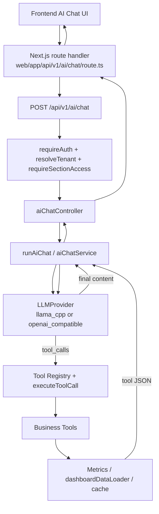

# AI / LLM Engineering — Backend (Phases 6–11)

Engineering documentation for the Toys Factory ERP backend AI assistant. This document covers work completed through **Phase 11**. It does **not** describe Phase 12 or later work.

**Scope:** `toys_factory_erp_backend/` — all AI code lives under `src/ai/` plus the HTTP entry point in `src/controllers/aiChatController.ts`.

---

## 1. Overview

### Purpose

The ERP AI assistant lets authenticated users ask natural-language questions about business metrics (sales, revenue, dashboard KPIs, low stock). The LLM may call **read-only business tools** that reuse existing metrics services and dashboard data loaders. The assistant must not invent figures or mutate ERP data.

### Current capabilities (Phase 11)

- Opt-in LLM provider (`AI_ENABLED=true`)
- OpenAI-compatible and local **llama.cpp** providers
- Five production read-only tools: `getTodaySales`, `getSalesTrend`, `getRevenueTrend`, `getDashboardSummary`, `getLowStockCount`
- Stateless chat API: `POST /api/v1/ai/chat`
- Controlled multi-round tool loop (max rounds configurable)
- Full auth, tenant resolution, and section RBAC on the chat route

### Isolation from the normal ERP request path

AI execution is **not** wired into standard CRUD, dashboard HTTP handlers, or middleware outside the dedicated chat route. Tools register lazily when AI chat runs; `ensureProductionToolsRegistered()` is **not** called from normal ERP HTTP paths. Business tools call existing **metrics services** (`src/services/metrics/`), which in turn use `dashboardDataLoader` and response cache — the same read paths as the dashboard, not duplicate Mongo access from the AI layer.

---

## 2. Phase 6 — LLM Provider Foundation

**Purpose:** Provider abstraction and HTTP normalization without adding a heavyweight SDK.

### Key paths

| Area | Path |
|------|------|
| Module root | `src/ai/` |
| Config | `src/ai/config/aiConfig.ts` |
| Client / singleton | `src/ai/client/llmClient.ts` |
| Provider factory | `src/ai/providers/createProvider.ts` |
| OpenAI-compatible | `src/ai/providers/openaiCompatibleProvider.ts` |
| llama.cpp | `src/ai/providers/llamaCppProvider.ts` |
| HTTP normalization | `src/ai/providers/httpChatCompletions.ts` |
| Types / errors | `src/ai/types.ts`, `src/ai/errors.ts` |

### LLMProvider abstraction

`LLMProvider` exposes:

- `generate(input, options?)` — text completion
- `generateWithTools(input, options?)` — chat completion with tool definitions and `tool_calls` passthrough

Both providers delegate to `postChatCompletions()` in `httpChatCompletions.ts`.

### Design decisions

- **Native `fetch`** — no axios or OpenAI SDK; keeps dependencies minimal and matches Node 20+.
- **Lazy singleton** — `getLlmProvider()` caches one provider instance per process (`resetLlmProviderForTests()` for tests). Config is read at first use; restart the server after `.env` changes.
- **Normalized responses** — provider layer maps OpenAI-style JSON to `content`, `finishReason`, `usage`, and `toolCalls[]`.
- **Per-request AbortController** — `mergeAbortSignals()` in `httpChatCompletions.ts` enforces `timeoutMs` from config (default **180000** ms unless overridden).

### Environment variables (`.env.example`)

| Variable | Default / notes |
|----------|-----------------|
| `AI_ENABLED` | `false` — **opt-in**; when not `true`, chat returns **503** |
| `AI_PROVIDER` | `llama_cpp` or `openai_compatible` |
| `AI_BASE_URL` | `http://127.0.0.1:8080/v1` (llama) or `https://api.openai.com/v1` |
| `AI_MODEL` | `Qwen/Qwen3-1.7B-GGUF` (llama default) or `gpt-4o-mini` (OpenAI default) |
| `AI_API_KEY` | Required for `openai_compatible` unless `AI_ALLOW_MISSING_KEY=true` |
| `AI_TIMEOUT_MS` | **180000** (ms) |
| `AI_ALLOW_MISSING_KEY` | `false` |
| `AI_DEBUG` | `false` — logs `[ai] POST …` when true |

When `AI_ENABLED` is not true, `loadAiConfig()` returns `{ enabled: false }` and the chat controller rejects before any provider call.

### llama.cpp-specific runtime options (Phase 11 fix)

For `llama_cpp` only, `createProvider.ts` adds:

- `maxTokens: 512`
- `chatTemplateKwargs: { enable_thinking: false }` — required for Qwen3 tool calling (see §9)

---

## 3. Phase 7 — Tool Registry + Function Calling Foundation

**Purpose:** Allowlisted, validated, RBAC-gated tool execution — never raw LLM → Mongo/HTTP.

### Key paths

| Area | Path |
|------|------|
| Registry | `src/ai/tools/toolRegistry.ts` |
| Executor | `src/ai/tools/toolExecutor.ts` |
| LLM bridge | `src/ai/tools/llmToolBridge.ts` |
| Schema validation | `src/ai/tools/schemas.ts` |
| Forbidden args | `src/ai/tools/forbiddenArgs.ts` |
| Authorization | `src/ai/tools/authorization.ts` |
| Execution context | `src/ai/context/buildAiContext.ts` |

### Allowlist model

- Tools are registered by name in an in-memory `Map` (`registerTool`, `getTool`, `listTools`).
- Unknown tool names → structured failure (`ToolNotFoundError`), not execution.
- Duplicate registration throws `ToolDuplicateNameError`.

### `executeToolCall(context, toolCall)`

Single entry point for all tool runs:

1. Parse JSON arguments; reject invalid JSON
2. Reject **forbidden keys** (`tenantId`, `userId`, `role`, `token`, `apiKey`, etc.) via `findForbiddenArgKeys()`
3. Validate against tool `inputSchema`
4. Check RBAC via `userCanExecuteTool()`
5. Call `tool.execute(context, validatedArgs)`
6. Return `ToolExecutionResult` (`ok: true` with `data`, or `ok: false` with sanitized `error`) — **does not throw** for tool-level failures; errors are fed back to the LLM as tool messages

### `executeLlmToolCalls()`

Batch helper in `llmToolBridge.ts` for multiple tool calls in one round.

### Fail-closed behavior

- Missing tool, bad schema, forbidden args, or RBAC denial → tool result with `ok: false`; no bypass.
- Tenant ID always comes from `AiExecutionContext`, built from authenticated request — **never** from LLM arguments.

### No direct Mongo / ERP HTTP from tools layer

Business tools import **metrics service functions** only. They do not use mongoose models, `fetch` to ERP routes, `eval`, or `new Function`.

---

## 4. Phase 8 — First Production Business Tool

**Tool:** `getTodaySales` — `src/ai/tools/business/getTodaySalesTool.ts`

### Behavior

- Calls `getTodaySales({ tenantId: context.tenantId })` from `src/services/metrics/salesMetrics.ts`
- Metrics layer uses `dashboardDataLoader` (same cache/loader path as dashboard APIs)
- Business date: Asia/Dhaka calendar (via metrics layer)
- **RBAC:** `requiredSections: ['dashboard']`

### Example tool result shape (success)

```json
{
  "date": "2026-08-27",
  "sales": 12500
}
```

### Tool execution flow

```
LLM tool_call(getTodaySales)
  → executeToolCall()
  → getTodaySalesTool.execute(context)
  → salesMetrics.getTodaySales({ tenantId })
  → dashboardDataLoader / cache
  → JSON tool message back to LLM
```

---

## 5. Phase 9 — AI Chat API + Controlled Agent Loop

**Route:** `POST /api/v1/ai/chat` — registered in `src/routes/api.routes.ts`, handler `src/controllers/aiChatController.ts`

### Middleware chain (existing ERP stack)

```
requireAuth → resolveTenant → requireSectionAccess → postAiChat
```

- **`/ai` prefix** maps to **`dashboard`** section in `src/config/apiSectionMap.ts` — user needs dashboard access to use AI chat.
- **Tenant:** `getRequestTenantId(req)` after `resolveTenant`; body/query `tenantId` mismatch → **403**.

### Request / response contract

**Request:**

```http
POST /api/v1/ai/chat
Content-Type: application/json
Cookie: token=…   (or Authorization: Bearer …)

{ "message": "আজকের sales কত?" }
```

Only `message` is accepted. No `tenantId`, `userId`, or role in the body.

**Success response:**

```json
{
  "success": true,
  "data": {
    "message": "…natural language answer…"
  }
}
```

**Error mapping** (`src/ai/chat/mapAiChatError.ts`):

| Condition | HTTP |
|-----------|------|
| AI disabled | 503 |
| Validation (empty/long message) | 400 |
| Unauthorized | 401 |
| Tool round limit | 429 |
| LLM timeout | 504 |
| Provider error | 502 |
| Unmapped exception | 500 (sanitized message) |

Provider/config messages are sanitized (Bearer tokens, `sk-…` patterns redacted).

### Agent loop (`src/ai/chat/aiChatService.ts`)

1. Build message list with user message + system prompt (`ERP_AI_SYSTEM_PROMPT`)
2. Call `llm.generateWithTools()` with all registered tools, `toolChoice: 'auto'`
3. If no `toolCalls` → return trimmed `content` (or fallback string)
4. If `toolCalls` → append assistant message (with `toolCalls`) + tool result messages → loop
5. Stop when `toolRounds > maxToolRounds` → **429**

**Limits** (`src/ai/chat/aiChatLimits.ts`):

| Env | Default |
|-----|---------|
| `AI_MAX_TOOL_ROUNDS` | 3 |
| `AI_MAX_MESSAGE_LENGTH` | 4000 |

### Message serialization

`httpChatCompletions.ts` `buildMessages()` serializes:

- `system` → system message
- `user` / `assistant` / `tool` roles
- Assistant replay: `tool_calls` array
- Tool results: `tool_call_id` + JSON string `content`

### Stateless design

No conversation ID, no server-side chat history, no MongoDB persistence. Each request is independent; multi-turn context exists only within a single request’s tool loop.

---

## 6. Phase 10 — Production ERP Business Tools

All registered in `src/ai/tools/business/registerProductionTools.ts` as `PRODUCTION_TOOLS`.

| Tool | Metrics service | RBAC section | Args |
|------|-----------------|--------------|------|
| `getTodaySales` | `salesMetrics.getTodaySales` | `dashboard` | none |
| `getSalesTrend` | `salesMetrics.getSalesTrend` | `dashboard` | `range`: day/week/month/quarter/year |
| `getRevenueTrend` | `salesMetrics.getRevenueTrend` | `dashboard` | `range` |
| `getDashboardSummary` | `dashboardMetrics.getDashboardSummaryMetrics` | `dashboard` | optional `scope`: kpi/extra/full |
| `getLowStockCount` | `inventoryMetrics.getLowStockCount` | `inventory` | none |

Shared JSON schemas: `src/ai/tools/business/sharedToolSchemas.ts`

**No mutation tools** — all tools are read-only aggregations.

**Tenant isolation** — every `execute()` receives `context.tenantId` from auth; metrics functions always filter by that tenant.

---

## 7. Phase 11 — Frontend Integration (backend-facing)

The Phase 11 UI calls this API only:

- **Endpoint:** `POST /api/v1/ai/chat` (via Next.js route handler — see frontend doc)
- **Auth:** Existing session cookie / Bearer token; no API keys in the browser
- **Body:** `{ message }` only
- **Lazy execution:** Backend LLM runs only when the chat endpoint is hit; no background AI jobs

Backend remains authoritative for tenant, RBAC, tool allowlist, and metrics data.

---

## 8. Current AI Architecture



### Security boundaries (explicit)

| Rule | Status |
|------|--------|
| AI business tools → direct HTTP to ERP routes | **NO** |
| AI tool layer → MongoDB directly | **NO** |
| LLM controls `tenantId` | **NO** |
| RBAC bypass | **NO** |
| Mutation / write tools | **NO** |

---

## 9. llama.cpp / Qwen Runtime Notes

Current intended local stack (from `.env.example` and `createProvider.ts`):

| Setting | Value |
|---------|--------|
| Provider | `llama_cpp` |
| Base URL | `http://127.0.0.1:8080/v1` |
| Model | `Qwen/Qwen3-1.7B-GGUF` |
| Backend timeout | `AI_TIMEOUT_MS=180000` |
| llama `max_tokens` | **512** (hardcoded for llama provider) |
| Qwen thinking | **`enable_thinking: false`** via `chat_template_kwargs` |

### Lessons learned

1. **Qwen3 thinking mode** — Without `enable_thinking: false`, the model may consume tokens in internal reasoning and fail to return `tool_calls` or visible `content` within timeout.
2. **High latency** — Local CPU inference commonly takes **~70–170+ seconds** per chat request (tool loop = multiple LLM round-trips). This is environment-dependent, not a guaranteed SLA.
3. **Next.js rewrite ~30s limit** — The generic rewrite in `next.config.ts` (`/api/v1/:path*` → backend) uses a **~30 second proxy timeout** in dev. AI requests exceeding that returned HTTP **500** / connection reset **before** the backend finished. **Fix (Phase 11):** dedicated Next.js route handler at `web/app/api/v1/ai/chat/route.ts` with **190000 ms** proxy timeout (documented in frontend AI doc).
4. **Model ID** — `AI_MODEL` must match the model exposed by llama.cpp `/v1/models`.

Performance tuning (faster model, GPU, streaming) remains **future work**.

---

## 10. Security Model

- **API keys** — `AI_API_KEY` env only; never sent to frontend or returned in errors
- **Tenant** — `resolveTenant` + `getRequestTenantId(req)`; LLM cannot supply tenant
- **Forbidden tool args** — `forbiddenArgs.ts` blocks identity/RBAC/credential keys in tool JSON
- **RBAC** — `userCanExecuteTool()` mirrors section access; admin bypasses section checks
- **Error sanitization** — `mapAiChatError.ts` redacts Bearer/sk- patterns
- **No** `eval` / `new Function` in AI module
- **No** mongoose in `src/ai/tools/business/*`
- **Diagnostic logs** — `[AI_CHAT]` console logs in controller/service record lifecycle only (no prompts, cookies, JWTs, or API keys)

---

## 11. Testing

### Counts (verified from repository)

| Scope | Result |
|-------|--------|
| All unit tests (`npx vitest run --project unit`) | **216 passed** (35 files) |
| AI unit tests (`tests/unit/ai/**`) | **118 passed** (20 files) |

### AI test coverage includes

- `aiConfig`, `llmClient`, `createProvider`, `llamaCppProvider`, `openaiCompatibleProvider`
- `aiChatService`, `aiChatController`, `aiContext`
- `toolRegistry`, `toolExecutor`, `authorization`, `forbiddenArgs`, `schemas`, `llmToolBridge`
- All five business tools + `registerProductionTools`

### Build / lint

- `npm run lint` (`tsc --noEmit`) — passes on current tree
- `npm run build` — TypeScript compile to `dist/`

Integration tests against live llama.cpp are **not** in the unit suite; local smoke tests are manual.

---

## 12. Performance

- AI runs **only** on explicit `POST /api/v1/ai/chat` — no AI on dashboard page load or CRUD
- Normal dashboard HTTP routes and cache behavior are **unchanged**
- Tools reuse metrics + `dashboardDataLoader` — no duplicate aggregation logic
- Local llama.cpp latency is **high** on CPU; frontend waits up to **190s** (see frontend doc)
- Next.js rewrite timeout issue resolved by dedicated route handler (not by changing ERP metrics)

---

## 13. Current Limitations / Deferred Work

**Not implemented** (as of Phase 11):

- Conversation persistence / chat history storage
- Streaming responses (SSE/chunked)
- Additional business tools (mutations, CRM actions, etc.)
- Faster inference / model hosting guidance in-repo
- Phase 12 features

---

## 14. Phase Status Table

| Phase | Purpose | Status | Important outcome |
|-------|---------|--------|-------------------|
| 6 | LLM provider foundation | Complete | `LLMProvider`, fetch-based HTTP, opt-in config, timeouts |
| 7 | Tool registry + executor | Complete | Allowlist, schema validation, RBAC, forbidden args |
| 8 | First business tool | Complete | `getTodaySales` via metrics/cache |
| 9 | Chat API + agent loop | Complete | `POST /api/v1/ai/chat`, stateless tool loop, error mapping |
| 10 | Production read-only tools | Complete | 5 tools, metrics reuse, no mutations |
| 11 | Frontend integration (API) | Complete | Cookie auth, `{ message }` only, long-timeout proxy path |

**Phase 12:** Not started.

---

## For Future Developers

1. **Enable AI:** Set `AI_ENABLED=true` and provider vars in `.env`; restart backend so `getLlmProvider()` reloads config.
2. **Add a read-only tool:** Define in `src/ai/tools/business/`, add to `PRODUCTION_TOOLS`, reuse a metrics service, set `requiredSections`, add unit tests under `tests/unit/ai/tools/business/`.
3. **Never** accept `tenantId` from the LLM or request body for tool execution.
4. **Qwen + llama.cpp:** Keep `enable_thinking: false` unless you validate tool calling without it.
5. **Long requests:** Frontend must use the dedicated Next.js AI route handler — not rely on the 30s rewrite proxy for `/ai/chat`.
6. **After `.env` changes:** Restart backend; provider singleton caches first-loaded config.

---

*Last aligned with codebase: Phases 6–11 complete. Configuration defaults from `src/ai/config/aiConfig.ts` and `.env.example`.*
