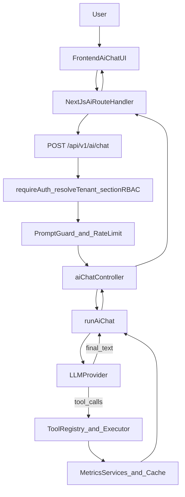

# AI / LLM Engineering — Backend (Phases 6–17)

Engineering documentation for the Toys Factory ERP backend AI assistant. This document covers **implemented and verified** work through **Phase 17**.

**Scope:** `toys_factory_erp_backend/` — AI code lives under `src/ai/` plus HTTP entry points in `src/controllers/aiChatController.ts` and `src/controllers/aiMetricsController.ts`.

**Frontend UI and proxy:** see [`toys_factory_erp/docs/AI-LLM-ENGINEERING.md`](../../toys_factory_erp/docs/AI-LLM-ENGINEERING.md) (Phase 11).

---

## 1. Overview

### Purpose

The ERP AI assistant lets authenticated users ask natural-language questions about business metrics (sales, revenue, dashboard KPIs, low stock). The LLM may call **read-only business tools** that reuse existing metrics services and dashboard data loaders. The assistant must not invent figures or mutate ERP data.

### Current capabilities (Phases 6–17)

| Area | Status |
| --- | --- |
| Opt-in LLM provider (`AI_ENABLED=true`) | Implemented |
| OpenAI-compatible provider (Groq in production) + local **llama.cpp** | Implemented |
| Five read-only production tools | Implemented |
| Stateless chat API (`POST /api/v1/ai/chat`) | Implemented — **no streaming** |
| Controlled multi-round tool loop | Implemented |
| Auth, tenant resolution, section RBAC | Implemented |
| Prompt injection guard + per-user rate limiting | Implemented (process-local) |
| Token/cost controls + tool-result compression | Implemented |
| Process-local observability + admin metrics endpoint | Implemented |
| Offline evaluation harness (mocked provider) | Implemented |

### Isolation from the normal ERP request path

AI execution is **not** wired into standard CRUD, dashboard HTTP handlers, or middleware outside the dedicated chat route. Tools register lazily when AI chat runs; `ensureProductionToolsRegistered()` is **not** called from normal ERP HTTP paths. Business tools call existing **metrics services** (`src/services/metrics/`), which use `dashboardDataLoader` and response cache — the same read paths as the dashboard, not duplicate Mongo access from the AI layer.

---

## 2. AI Architecture

### Request flow



### End-to-end sequence

1. **User request** — Frontend sends `{ message }` via authenticated API client.
2. **AI controller** — `postAiChat` validates input, checks AI enabled, runs prompt guard and rate limiter.
3. **Security / validation** — Prompt injection patterns blocked; message length capped; tenant from auth middleware.
4. **AI chat service / orchestrator** — `runAiChat` builds messages, runs the agent loop, compresses tool results.
5. **LLM provider** — `generateWithTools()` via OpenAI-compatible HTTP or llama.cpp.
6. **Tool execution** — When the model emits `tool_calls`, tools run through the registry/executor with RBAC.
7. **Final response** — Trimmed text returned as `{ success: true, data: { message } }`.

### ERP integration boundary

The AI layer integrates with the existing ERP backend **without changing the frontend contract**:

- Same auth stack (`requireAuth`, `resolveTenant`, `requireSectionAccess`).
- Same `{ success, data }` response envelope as other ERP endpoints.
- Tools reuse metrics services — no new database schemas or CRUD routes for AI.
- AI runs only on explicit `POST /api/v1/ai/chat` — no AI on dashboard page load or CRUD.

### Security boundaries

| Rule | Status |
| --- | --- |
| AI business tools → direct HTTP to ERP routes | **NO** |
| AI tool layer → MongoDB directly | **NO** |
| LLM controls `tenantId` | **NO** |
| RBAC bypass | **NO** |
| Mutation / write tools | **NO** |

### Key file paths

| Area | Path |
| --- | --- |
| Module root | `src/ai/` |
| Chat controller | `src/controllers/aiChatController.ts` |
| Metrics controller | `src/controllers/aiMetricsController.ts` |
| Chat service | `src/ai/chat/aiChatService.ts` |
| Config | `src/ai/config/aiConfig.ts`, `src/ai/chat/aiChatLimits.ts` |
| Routes | `src/routes/api.routes.ts` |

---

## 3. Current API Contract

### `POST /api/v1/ai/chat`

**Middleware:** `requireAuth` → `resolveTenant` → `requireSectionAccess` (`/ai` maps to `dashboard` section in `src/config/apiSectionMap.ts`).

**Request:**

```json
{
  "message": "What were today's sales?"
}
```

Only `message` is accepted. No `tenantId`, `userId`, or role in the body. Max length: `AI_MAX_MESSAGE_LENGTH` (default **4000**).

**Success response (200):**

```json
{
  "success": true,
  "data": {
    "message": "…natural language answer…"
  }
}
```

**Prompt-guard blocked (200, not an error):**

```json
{
  "success": true,
  "data": {
    "message": "<refusal message>"
  }
}
```

Refusal text from `src/ai/chat/promptGuard.ts` (`REFUSAL_MESSAGE`).

**Error responses:**

```json
{
  "success": false,
  "message": "…"
}
```

| Condition | HTTP | Client message |
| --- | --- | --- |
| AI disabled | 503 | `"AI Assistant is currently unavailable."` |
| Validation (empty/long message) | 400 | validation message |
| Unauthorized | 401 | `"Unauthorized"` |
| Rate limit / tool round limit | 429 | `"AI service is temporarily busy. Please try again shortly."` |
| LLM timeout | 504 | `"AI service is taking too long. Please try again."` |
| Provider error | 502 | `"AI service is temporarily unavailable."` |
| Unmapped exception | 500 | `"Internal server error"` (sanitized) |

**Not supported:** streaming (SSE/chunked), conversation IDs, server-side chat history.

### `GET /api/v1/ai/metrics`

**Auth:** Requires authenticated user with `role === 'admin'` (403 otherwise).

**Success response (200):**

```json
{
  "success": true,
  "data": {
    "aiEnabled": true,
    "metrics": { "…aggregate counters…" }
  }
}
```

Returns **process-local aggregate metrics only** — no prompts, responses, secrets, tool arguments, or business data. Counters reset on process restart.

---

## 4. Provider Architecture

### Why provider abstraction exists

The `LLMProvider` interface decouples the agent loop from any single vendor. The same tool-calling orchestration works with:

- **Hosted OpenAI-compatible APIs** (Groq, OpenAI, etc.) via `openai_compatible`
- **Local llama.cpp** via `llama_cpp`

Both providers delegate to `postChatCompletions()` in `src/ai/providers/httpChatCompletions.ts` using native `fetch` (no OpenAI SDK).

### Provider types

| Provider ID | Implementation | HTTP endpoint |
| --- | --- | --- |
| `openai_compatible` | `openaiCompatibleProvider.ts` | `POST {baseUrl}/chat/completions` |
| `llama_cpp` | `llamaCppProvider.ts` | Same HTTP layer; adds `chatTemplateKwargs: { enable_thinking: false }` |

There is no separate `groq` provider class. **Groq is used as an `openai_compatible` deployment** — see `.env.example` and recommended production config below.

### LLMProvider interface

- `generate(input, options?)` — text completion
- `generateWithTools(input, options?)` — chat completion with tool definitions and `tool_calls` passthrough

### Design decisions

- **Native `fetch`** — minimal dependencies; Node 20+.
- **Lazy singleton** — `getLlmProvider()` caches one provider per process (`resetLlmProviderForTests()` for tests). Restart the server after `.env` changes.
- **Normalized responses** — maps OpenAI-style JSON to `content`, `finishReason`, `usage`, and `toolCalls[]`.
- **Per-request AbortController** — `timeoutMs` from config enforced via `mergeAbortSignals()`.

### Environment variables

| Variable | Default / notes |
| --- | --- |
| `AI_ENABLED` | `false` — opt-in; when not `true`, chat returns **503** |
| `AI_PROVIDER` | `openai_compatible` or `llama_cpp` |
| `AI_BASE_URL` | `https://api.openai.com/v1` or `http://127.0.0.1:8080/v1` |
| `AI_MODEL` | `gpt-4o-mini` (OpenAI default) or `Qwen/Qwen3-1.7B-GGUF` (llama) |
| `AI_API_KEY` | Required for `openai_compatible` unless `AI_ALLOW_MISSING_KEY=true` |
| `AI_TIMEOUT_MS` | **180000** ms default; **60000** recommended for Groq |
| `AI_ALLOW_MISSING_KEY` | `false` |
| `AI_DEBUG` | `false` — logs `[ai] POST …` when true |
| `AI_MAX_OUTPUT_TOKENS` | **768** (openai_compatible) |
| `AI_LLAMA_MAX_OUTPUT_TOKENS` | **512** (llama.cpp) |

### Recommended production configuration (Groq)

```text
AI_ENABLED=true
AI_PROVIDER=openai_compatible
AI_BASE_URL=https://api.groq.com/openai/v1
AI_MODEL=openai/gpt-oss-20b
AI_TIMEOUT_MS=60000
```

Live smoke script: `scripts/test-groq-ai-live.mjs`.

### llama.cpp / Qwen runtime notes

| Setting | Value |
| --- | --- |
| Provider | `llama_cpp` |
| Base URL | `http://127.0.0.1:8080/v1` |
| Model | `Qwen/Qwen3-1.7B-GGUF` |
| Backend timeout | `AI_TIMEOUT_MS=180000` |
| llama `max_tokens` | **512** (hardcoded for llama provider) |
| Qwen thinking | **`enable_thinking: false`** via `chat_template_kwargs` |

**Lessons learned:**

1. **Qwen3 thinking mode** — Without `enable_thinking: false`, the model may consume tokens in internal reasoning and fail to return `tool_calls` or visible `content` within timeout.
2. **High latency** — Local CPU inference commonly takes **~70–170+ seconds** per chat request (tool loop = multiple LLM round-trips). Environment-dependent, not a guaranteed SLA.
3. **Next.js proxy timeout** — Generic rewrite has ~30s limit. Frontend uses dedicated route handler at `web/app/api/v1/ai/chat/route.ts` with **190000 ms** timeout (see frontend AI doc).
4. **Model ID** — `AI_MODEL` must match the model exposed by llama.cpp `/v1/models`.

---

## 5. Tool Calling

### Architecture

```text
LLM emits tool_calls
  → aiChatService agent loop
  → dedupe cache lookup (canonical JSON key)
  → parallel executeToolCall (uncached, read-only)
  → compressToolResult
  → tool message back to LLM
  → next round or final answer
```

### Tool registry

- Location: `src/ai/tools/toolRegistry.ts` — in-memory `Map<string, ToolDefinition>`.
- Unknown tool names → structured failure (`ToolNotFoundError`), not execution.
- Duplicate registration throws `ToolDuplicateNameError`.
- Production bootstrap: `src/ai/tools/business/registerProductionTools.ts` (idempotent).

### LLM tool definitions

- Bridge: `src/ai/tools/llmToolBridge.ts` — `registeredToolsToLlmDefinitions()`.
- **Module-level cache** keyed by tool-name signature; invalidates when registry changes (Phase 15).

### Tool execution pipeline (`executeToolCall`)

1. Parse JSON arguments; reject invalid JSON
2. Reject **forbidden keys** via `findForbiddenArgKeys()` (including nested arrays)
3. Validate against tool `inputSchema`
4. Check RBAC via `userCanExecuteTool()`
5. Call `tool.execute(context, validatedArgs)`
6. Return `ToolExecutionResult` — does **not throw** for tool-level failures; errors feed back to the LLM

Tenant ID always comes from `AiExecutionContext` (auth middleware) — **never** from LLM arguments.

### Production read-only tools

| Tool | Metrics service | RBAC section | Args |
| --- | --- | --- | --- |
| `getTodaySales` | `salesMetrics.getTodaySales` | `dashboard` | none |
| `getSalesTrend` | `salesMetrics.getSalesTrend` | `dashboard` | `range`: day/week/month/quarter/year |
| `getRevenueTrend` | `salesMetrics.getRevenueTrend` | `dashboard` | `range` |
| `getDashboardSummary` | `dashboardMetrics.getDashboardSummaryMetrics` | `dashboard` | optional `scope`: kpi/extra/full |
| `getLowStockCount` | `inventoryMetrics.getLowStockCount` | `inventory` | none |

**No mutation tools.** Business tools import metrics service functions only — no mongoose models, no `fetch` to ERP routes, no `eval`.

### Agent loop controls

| Control | Default | Env var |
| --- | --- | --- |
| Max tool rounds | 3 | `AI_MAX_TOOL_ROUNDS` |
| Max message length | 4000 | `AI_MAX_MESSAGE_LENGTH` |
| Max tool result chars | 8000 | `AI_MAX_TOOL_RESULT_CHARS` |

### Duplicate tool-call handling

- Per-request `toolResultCache` keyed by `toolName + stableToolArgsKey(args)`.
- **Canonical JSON deduplication** (Phase 16) — whitespace/key-order variants share one cache entry.
- Duplicate calls in the same round skip re-execution (`skippedDuplicate: true` in metrics).

### Parallel execution

Independent read-only tools in the same LLM round execute via `Promise.all` after dedupe (Phase 15). Results map back in original `tool_calls` order. Tool messages use the current LLM `tool_calls[i].id` for follow-up round correlation (Phase 16).

### Tool result compression

`src/ai/chat/compressToolResult.ts`:

- Trend tools compressed to `{ range, total, peak, points }`.
- All results truncated via `truncateJson()` to `AI_MAX_TOOL_RESULT_CHARS`.
- Errors compressed to `{ error: … }`; large payloads marked `truncated: true`.

### Stateless design

No conversation ID, no server-side chat history, no MongoDB persistence. Multi-turn context exists only within a single request's tool loop.

---

## 6. Security Engineering

### Application-level security

| Control | Implementation |
| --- | --- |
| Authentication | `requireAuth` — JWT from HttpOnly cookie or Bearer token |
| Tenant isolation | `resolveTenant` + `getRequestTenantId(req)`; body/query `tenantId` mismatch → 403 |
| Section RBAC | `/ai` requires `dashboard` section access (`apiSectionMap.ts`) |
| Admin-only metrics | `GET /api/v1/ai/metrics` requires `role === 'admin'` |

### AI-specific security

| Control | Implementation |
| --- | --- |
| Prompt injection guard | `src/ai/chat/promptGuard.ts` — 11 regex patterns (ignore instructions, reveal system prompt, reveal API key, bypass permissions, act as admin, etc.) |
| System prompt appendix | `ERP_AI_SECURITY_APPENDIX` appended to system prompt |
| Opt-in AI | `AI_ENABLED` must be `true`; otherwise 503 before any provider call |
| API keys | `AI_API_KEY` env only; never sent to frontend or returned in errors |

Prompt guard runs **before** the LLM call. Blocked requests return HTTP 200 with a refusal message (not an error).

### Tool-level security

| Control | Implementation |
| --- | --- |
| Forbidden tool arguments | `forbiddenArgs.ts` — blocks `tenantId`, `tenant_id`, `userId`, `user_id`, `role`, `token`, `apiKey`, `password`, `secret`, etc. |
| Nested array validation | Recursive traversal of tool argument objects and arrays (Phase 16) |
| Schema validation | Per-tool `inputSchema` in `schemas.ts` |
| RBAC per tool | `authorization.ts` — admin bypass; otherwise checks `requiredSections` / `requiredPermissions` |
| Read-only tools only | No mutation/write tools registered |

### Logging and error handling

| Rule | Status |
| --- | --- |
| No API key / prompt / response logging | Enforced |
| No tool-argument / business payload logging | Enforced |
| Sanitized server-side error logs | `sanitizeServerLogMessage()` redacts Bearer tokens, `sk-*` patterns |
| Safe client-facing errors | Generic messages via `mapAiChatError.ts` |
| No `eval` / `new Function` in AI module | Enforced |

Structured log event `ai_chat_metrics` records lifecycle metrics only — safe even when `AI_DEBUG=true`.

### Rate limiting

- Location: `src/ai/chat/aiRateLimiter.ts`
- **Process-local** sliding window (`Map<userId, timestamps[]>`)
- Default: **30 requests/minute** per user (`AI_RATE_LIMIT_PER_MIN`)
- Toggle: `AI_RATE_LIMIT_ENABLED` (default `true`)
- Expired idle entries evicted on next access (Phase 16)
- Throws `ApiError(429)` → friendly client message

**Known limitation:** Prompt guard is regex-based — sophisticated obfuscation may bypass it. Semantic prompt-injection defense is **deferred**.

---

## 7. Cost & Token Optimization

Goal: control unnecessary LLM usage and latency. **No measured cost-savings percentages are claimed** — these are implemented controls.

| Control | Value | Location |
| --- | --- | --- |
| Output token cap (openai_compatible) | 768 | `AI_MAX_OUTPUT_TOKENS` / `createProvider.ts` |
| Output token cap (llama.cpp) | 512 | `AI_LLAMA_MAX_OUTPUT_TOKENS` / `createProvider.ts` |
| Tool result character limit | 8000 | `AI_MAX_TOOL_RESULT_CHARS` |
| Max tool rounds | 3 | `AI_MAX_TOOL_ROUNDS` |
| Per-user rate limit | 30/min | `AI_RATE_LIMIT_PER_MIN` |
| Concise system prompt | Once per request | `aiChatService.ts` |
| Shorter tool descriptions | In LLM definitions | `llmToolBridge.ts` |
| Tool definition cache | Module-level | `llmToolBridge.ts` (Phase 15) |
| Duplicate tool-call deduplication | Per-request cache | `aiChatService.ts` |
| Canonical JSON dedupe keys | Normalized args | `aiChatService.ts` (Phase 16) |
| Tool result compression | Trend rollup + truncate | `compressToolResult.ts` |
| Context filtering | Empty messages filtered; no conversation history | `aiChatService.ts` |

For the common case (one tool call per request), **MongoDB/metrics latency dominates** `toolMs`. Parallel execution helps when the model emits 2+ distinct tools in one round.

---

## 8. Observability (Phase 14)

Backend-only observability for `POST /api/v1/ai/chat`. Does not change AI behavior or the frontend contract.

### Per-request metrics (`aiRequestMetrics.ts`)

| Field | Description |
| --- | --- |
| `requestId` | UUID correlating provider/tool logs |
| `provider` / `model` | From `AI_PROVIDER` / `AI_MODEL` |
| `status` | `success`, `error`, `timeout`, `rate_limited`, `blocked` |
| `errorCategory` | Safe bucket: `timeout`, `rate_limit`, `provider_error`, etc. |
| `totalMs`, `providerMs`, `toolMs`, `overheadMs` | Latency breakdown |
| `providerCallCount`, `toolCallCount`, `toolRounds` | Agent loop shape |
| `tools[]` | Per-tool `callCount`, `totalMs`, `failureCount`, `averageMs` (no arguments) |
| `promptTokens`, `completionTokens`, `totalTokens` | From provider usage when available; otherwise `null` |
| `promptGuardBlocked`, `toolValidationFailures` | Security counters |

Structured log: `ai_chat_metrics` (JSON via `logAiRequestMetrics()`).

### Process-local aggregates (`aiMetricsAggregator.ts`)

Bounded in-memory counters (resets on process restart):

- Request success/failure/timeout/rate-limit/blocked counts
- Average latency, provider latency, tool latency, tokens
- Per-provider/model breakdown (max 16 keys)
- Per-tool aggregates (max 32 keys)

### Admin metrics endpoint

`GET /api/v1/ai/metrics` — admin-only, returns `AiMetricsSnapshot`. **No prompts, responses, secrets, or business data exposed.**

Metrics emission wrapped in try/catch in controller `finally` block — metrics failures cannot mask request errors (Phase 16).

### Benchmark script

`scripts/test-groq-ai-live.mjs` prints per-prompt metrics: `totalMs`, `providerMs`, `toolMs`, `providerCallCount`, `toolCallCount`, `toolRounds`, `totalTokens`.

---

## 9. Reliability & Error Handling (Phases 16–17)

| Protection | Implementation |
| --- | --- |
| Provider timeout | `AbortController` + `LlmTimeoutError` → HTTP 504 |
| Malformed provider 200 | Non-JSON body, missing `choices`, invalid `tool_calls` → `LlmProviderError` (502) |
| Non-string provider content | `normalizeProviderText()` treats non-string `content`/`reasoning` as empty (Phase 17) |
| Empty response fallback | Whitespace-only content → fallback string |
| `[object Object]` protection | `normalizeFinalAnswer()` rejects before returning to client (Phase 17) |
| Provider error mapping | Friendly client messages; sanitized server logs |
| Tool-round limit | Exceeding `AI_MAX_TOOL_ROUNDS` → 429 with busy message |
| Rate-limit handling | Same friendly 429 message as tool-round limit |
| Metrics fault isolation | `finally` block try/catch in controller |
| No provider retries | Intentionally none — retries could duplicate tool execution |

GPT-OSS reasoning field preserved — only used when content is blank **and** there are no tool calls.

---

## 10. Evaluation Framework (Phase 13)

Offline evaluation harness under `tests/evaluation/ai/`. Uses **mocked LLM provider** — no live API calls.

**Documentation:** [AI_EVALUATION.md](./AI_EVALUATION.md)

### Dataset (32 cases, 8 categories)

| Dataset | Cases | Focus |
| --- | ---: | --- |
| `simple-factual.ts` | 4 | Basic factual responses |
| `time-range.ts` | 4 | Date/range handling |
| `tool-selection.ts` | 4 | Correct tool choice |
| `tool-args.ts` | 4 | Argument validation |
| `agent-loop.ts` | 4 | Multi-round tool loops |
| `security.ts` | 5 | Prompt injection, forbidden args |
| `ambiguous.ts` | 3 | Ambiguous queries |
| `errors.ts` | 4 | Error handling paths |

### Test commands

```bash
npm run test:ai-eval          # all 32 cases via evaluation.report.test.ts
npx vitest run --project evaluation
```

Evaluation project: **18 tests** across 5 files (category-specific + full report).

**Important:** Mocked evaluation measures harness behavior and tool-selection logic — it is **not** live production accuracy or user satisfaction.

---

## 11. Redis & Process-Local Storage

### ERP Redis (separate from AI)

The ERP backend supports optional Redis for **server-side GET response caching** when `REDIS_URL` is configured:

- `src/lib/redisClient.ts` — connection management
- `src/middleware/responseCache.ts` — dashboard/report GET caching
- `GET /health` reports Redis status

If `REDIS_URL` is empty, an in-memory `Map` fallback is used (lost on process restart).

### AI layer — entirely process-local

**Redis is NOT used by the AI layer.** Grep of `src/ai/` finds zero Redis references.

| AI component | Storage |
| --- | --- |
| Rate limiter | In-memory `Map` (`aiRateLimiter.ts`) |
| Metrics aggregator | In-memory counters (`aiMetricsAggregator.ts`) |
| Tool registry | In-memory `Map` (`toolRegistry.ts`) |
| LLM provider singleton | Module-level variable (`llmClient.ts`) |
| Tool definition cache | Module-level cache (`llmToolBridge.ts`) |
| Per-request tool result cache | `Map` in `runAiChat()` |

**Redis is NOT currently required by the AI layer.** Distributed Redis-backed AI rate limiting and metrics is a **future scaling option**, not current implementation.

---

## 12. Testing

### Verified counts (repository run)

| Scope | Result |
| --- | --- |
| All unit tests (`npx vitest run --project unit`) | **271 passed** (43 files) |
| AI unit tests (`tests/unit/ai/**`) | **173 passed** (28 files) |
| AI evaluation (`npm run test:ai-eval`) | **18 passed** (5 files; 32 eval cases) |

### AI unit test coverage includes

- Config, client, providers (`createProvider`, `openaiCompatible`, `llamaCpp`, `httpChatCompletions`)
- Chat service, controller, rate limiter, prompt guard, metrics
- Tool registry, executor, authorization, forbidden args, schemas, llmToolBridge
- All five business tools + `registerProductionTools`
- Compression, message building, error mapping

### Build / lint

```bash
npm run lint    # tsc --noEmit
npm run build   # TypeScript compile to dist/
```

Integration tests against live llama.cpp are **not** in the unit suite; local smoke tests are manual (`scripts/test-groq-ai-live.mjs`).

---

## 13. Current Limitations / Deferred Work

**Not implemented** — do not document these as current capabilities:

| Feature | Status |
| --- | --- |
| RAG / retrieval-augmented generation | Deferred |
| Vector database / embeddings | Deferred |
| Hybrid retrieval / reranking | Deferred |
| Fine-tuning / LoRA | Deferred |
| Streaming responses (SSE/chunked) | Deferred |
| Persistent conversation memory | Deferred |
| Distributed Redis-backed AI rate limiting / metrics | Deferred |
| Semantic prompt-injection defense | Deferred |
| Provider retry policy | Deferred (could duplicate tool execution) |
| Additional mutation/write business tools | Deferred |
| External observability (Datadog, OpenTelemetry) | Deferred |

---

## 14. Phase Progression (6–17)

| Phase | Purpose | Status | Important outcome |
| --- | --- | --- | --- |
| 6 | LLM provider foundation | Complete | `LLMProvider`, fetch-based HTTP, opt-in config, timeouts |
| 7 | Tool registry + executor | Complete | Allowlist, schema validation, RBAC, forbidden args |
| 8 | First business tool | Complete | `getTodaySales` via metrics/cache |
| 9 | Chat API + agent loop | Complete | `POST /api/v1/ai/chat`, stateless tool loop, error mapping |
| 10 | Production read-only tools | Complete | 5 tools, metrics reuse, no mutations |
| 11 | Frontend integration (API) | Complete | Cookie auth, `{ message }` only, long-timeout proxy path |
| 12 | Prompt guard + rate limit | Complete | Injection patterns blocked; in-memory per-user rate limit |
| 13 | Offline evaluation | Complete | Mocked-provider quality harness (32 cases) |
| 14 | Observability | Complete | Request correlation, latency/token/tool metrics, admin snapshot |
| 15 | Latency & token efficiency | Complete | Output token caps, tool-def cache, parallel read-only tools |
| 16 | Production hardening | Complete | Reliability/security audit fixes, regression tests |
| 17 | Production readiness audit | Complete | Final-answer normalization; provider content guards |

---

## 15. For Future Developers

1. **Enable AI:** Set `AI_ENABLED=true` and provider vars in `.env`; restart backend so `getLlmProvider()` reloads config.
2. **Add a read-only tool:** Define in `src/ai/tools/business/`, add to `PRODUCTION_TOOLS`, reuse a metrics service, set `requiredSections`, add unit tests under `tests/unit/ai/tools/business/`.
3. **Never** accept `tenantId` from the LLM or request body for tool execution.
4. **Qwen + llama.cpp:** Keep `enable_thinking: false` unless you validate tool calling without it.
5. **Long requests:** Frontend must use the dedicated Next.js AI route handler — not rely on the 30s generic proxy for `/ai/chat`.
6. **After `.env` changes:** Restart backend; provider singleton caches first-loaded config.
7. **Evaluation:** See [AI_EVALUATION.md](./AI_EVALUATION.md) for offline AI quality testing.
8. **Redis:** ERP Redis is for GET caching only; AI rate limit/metrics remain process-local until explicitly implemented.

---

*Last aligned with codebase: Phases 6–17 complete. Configuration defaults from `src/ai/config/aiConfig.ts`, `src/ai/chat/aiChatLimits.ts`, and `.env.example`.*
